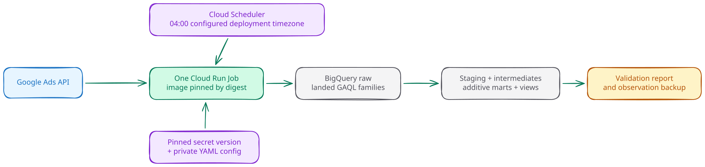
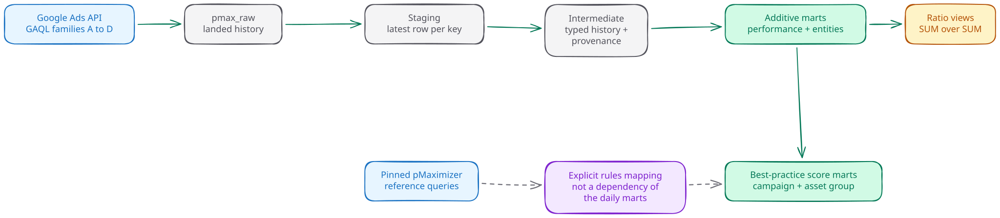
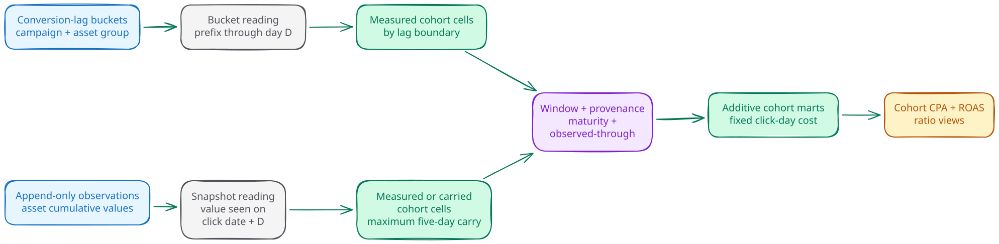
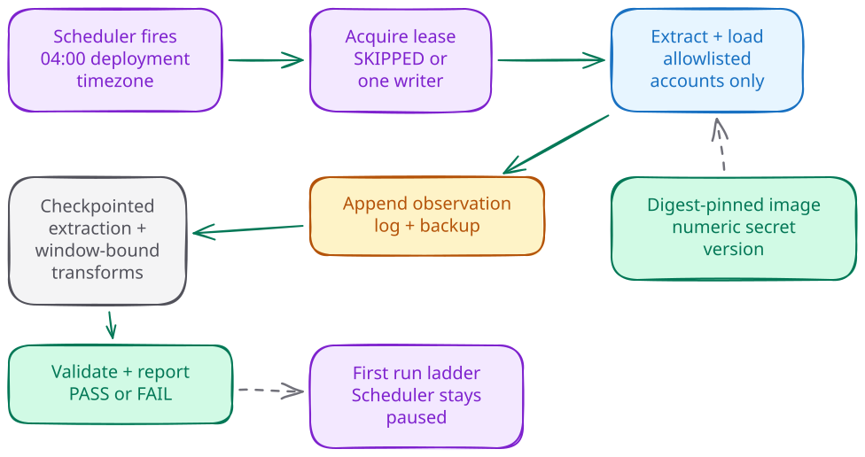

# pMax Performance Pack

**Growth × Engineering for Performance Max.** Turn Google Ads data into an
operator-owned BigQuery layer for best-practice scores, asset analysis, and
cohort CPA and ROAS.

The pack is for teams that need to inspect how Performance Max works, not just
read a dashboard. It extracts an exact account allowlist with gaarf, keeps the
landed history, builds additive marts, publishes safe ratio views, and leaves a
validation report after every run.

## What it adds

The pack is an independent solution. Google's open-source work remains visible
and attributed, but it is not a dependency of the daily marts. The parity
harness executes the pinned chain, and every report records its reference hash.

| Starting point | What the pack adds |
|---|---|
| pMaximizer | Pinned reference queries and an explicit rules mapping, then an independently testable Python and BigQuery daily runtime. The parity harness still executes Google's chain. The pack adds typed entity history, additive performance marts, cohort CPA and ROAS, provenance, and validation. |
| App Reporting Pack (ARP) | The same useful raw-to-output mental model, purpose-built for Performance Max. The pack adds a single Cloud Run Job, a phase-gated deploy, digest and secret-version pinning, lease and checkpoint controls, and evidence-bound release gates. |
| Platform reporting | Durable data at campaign, asset-group, and asset grain. Ratios are calculated after aggregation, and missing or immature cohort cells stay visible instead of being blended away. |

Our code, Google's reference material, tests, and CI remain separate:

- `src/pmax_pack/` contains the runtime and SQL.
- `src/pmax_pack/reference/pmaximizer/` contains the pinned reference, its pin,
  and `RULES.md`.
- `tests/fixtures/` contains sanitized synthetic fixtures.
- `.github/workflows/pr.yml` runs fixture-only checks without Google Ads or GCP
  credentials.

## Architecture

One private Cloud Run Job owns the daily data path. Cloud Scheduler starts it
at 04:00 in the configured deployment timezone. The Job reads a private config
object, mounts one numeric Secret Manager version, and writes BigQuery datasets
plus a report and an append-only observation backup.



[Edit the architecture scene](docs/diagrams/architecture.excalidraw)

The runtime image is pinned by digest. Pull-request and fork CI receive no
credentials and use sanitized fixtures only. Real-data parity runs only from a
protected operator execution and drops the scratch tables it created after the
run. The scratch datasets persist.

## Data model

Think of the layers like a spreadsheet:

- Raw partitions keep the latest landed copy for each table and day, with
  `loaded_at` and `run_id`. The append-only `raw_observations` table is the
  diary for cumulative asset observations.
- Staging and intermediate layers are formula sheets. They select the latest
  row per key, type it, and attach lineage and provenance.
- Marts are the nightly answer sheets. Their measures stay additive.
- Views calculate CPA, ROAS, and CTR as `SUM(numerator) / SUM(denominator)` at
  read time.



[Edit the data-model scene](docs/diagrams/data-model.excalidraw)

The current fork-table mapping keeps the recognizable pMaximizer outputs while
moving them onto the v2 contracts:

| Upstream fork query | Scope | v2 contract |
|---|---|---|
| `bq_queries/01-image_assets.sql` | Pinned BigQuery chain | `mart_entities_asset`, image URL, dimensions, and orientation |
| `bq_queries/02-primary_conversion_action_pmax.sql` | Pinned parity intermediate | Named actions and windows remain in `mart_entities_conversion_action`; no frequency-selected table is published |
| `bq_queries/03-primary_conversion_action_search.sql` | Pinned parity intermediate | Named actions and windows remain in `mart_entities_conversion_action`; no frequency-selected table is published |
| `bq_queries/04-text_assets.sql` | Pinned BigQuery chain | `mart_entities_asset`, text and field-type rows |
| `bq_queries/05-video_assets.sql` | Pinned BigQuery chain | `mart_entities_asset`, video ID, title, and orientation |
| `bq_queries/07-campaign_data.sql` | Pinned BigQuery chain | Campaign, asset-group signal, campaign-asset, and customer entity marts |
| `bq_queries/09-bpscore.sql` | Pinned BigQuery chain | `mart_bp_campaign` |
| `bq_queries/10-assetgroupbestpractices.sql` | Pinned BigQuery chain | `mart_bp_asset_group` |
| `google_ads_queries/campaign_settings.sql` | Pinned, unnumbered GAQL input | Campaign entity settings plus `mart_bp_campaign` scores |
| `assetgroupperformance` | Upstream output outside the current pin | Additive metrics in `mart_performance_asset_group`; the constant performance label is deliberately dropped |

`assetgroupperformance` is a legacy upstream mapping, not a file in the current
pin. The pack makes no file-level parity claim for transformations outside that
pin.

The detailed grain, partition, clustering, money, provenance, and ratio
contracts live in [docs/data-model.md](docs/data-model.md). Asset attributions
are not expected to sum to campaign totals. Use `mart_campaign_truth` for the
campaign total.

## Cohort CPA and ROAS

The cohort layer preserves two valid readings of cohort day D:

1. Campaign and asset-group cells use Google's conversion-lag buckets. A D
   cell is the prefix of buckets whose upper boundary is at most D.
2. Asset cells use the observation stream. A D cell is the cumulative value
   visible on click date plus D in the account timezone.

Those readings can differ at the same boundary. Every cell therefore carries
`provenance`, `maturity`, and `observed_through`.



[Edit the cohort scene](docs/diagrams/cohort-mechanism.excalidraw)

The window rule is strict:

- Configured rungs are D1 to D14, D21, D30, D45, D60, or D90.
- An action's click-through lookback window caps its ladder. Days after the
  window do not exist.
- The final rung is always the window and is labelled `D<window> window`.
- A window on a bucket boundary uses the bucket prefix. A non-boundary window
  uses the click-day conversion total for the selected basis.
- A missed asset observation may carry the prior non-seed value for at most
  five calendar days. Longer gaps are unavailable, never forecast.
- A cell becomes complete only when the selected source has refreshed through
  click date plus D. Calendar age alone is not maturity evidence.

Cohort marts keep fixed click-day cost and additive conversion components.
`v_cohort_*` excludes missing-cost cells, then calculates cohort CPA and ROAS
after aggregation. See [docs/cohorts.md](docs/cohorts.md) for the complete
contract.

## Deploy with one command

Requirements: Python 3.12 through `uv`, Google Cloud CLI, `bq`, Docker buildx,
and an existing billed GCP project in `europe-west1` labelled `app=pmax`. The
organization policy `iam.disableServiceAccountKeyCreation` must be enforced,
the config must set `timezone_override`, and the operator-owned Google Ads
credential file must stay outside the repository. Shellcheck is useful for
development, but the deploy ladder does not invoke it.

Review the non-mutating plan first:

```bash
export PMAX_PROJECT_ID="your-gcp-project-id"
export PMAX_CONFIG_BUCKET="your-private-config-bucket"
export PMAX_CONFIG_FILE="/secure/path/deployment.yaml"
export PMAX_CREDENTIAL_FILE="/secure/path/google-ads.yaml"

bash deploy/deploy.sh \
  --project "$PMAX_PROJECT_ID" \
  --region europe-west1 \
  --config-uri "gs://$PMAX_CONFIG_BUCKET/deployment.yaml" \
  --config-file "$PMAX_CONFIG_FILE" \
  --credential-file "$PMAX_CREDENTIAL_FILE" \
  --plan
```

`--plan` performs read-only target checks and prints the full ladder. Never use
`--yes`. A live non-interactive invocation can cross a human-owned phase only
when the operator has written that exact phase into `PMAX_CONFIRMED_PHASES`.
For example, API, IAM, WIF, and invoker work use the phase names `10-apis`,
`40-iam`, `45-wif`, and `55-invoker`. The operator decides the list for each
invocation.

The phases are ordered so evidence arrives before authority:

| Phases | Result |
|---|---|
| 00 to 30 | Preflight, APIs, data resources, upgrade-only cost dry-run, and pinned secret |
| 40 to 65 | IAM, WIF, image build or digest reuse, invoker, paused Scheduler, and config record |
| 70 to 80 | First run, lease drill, and parity evidence |
| 85 | Human review of the persisted report and evidence |
| 88 to 95 | Rehearsal, failed-execution alert proof, and operator-owned resume |

Phase 85 may never appear in `PMAX_CONFIRMED_PHASES`. It validates
`PMAX_SIGNED_REVIEW` first and pauses for the operator unless a valid signed
file is supplied. That file is personally authored by the operator and bound
to the exact run, image digest, report, parity evidence, and review time.
Agents and automation must never create or supply it.

## Daily operation



[Edit the daily-run scene](docs/diagrams/daily-run.excalidraw)

The daily Job acquires a lease before it writes. A concurrent execution exits
`SKIPPED`. Successful chunks record checkpoints, so a retry resumes from
persisted work. Every eligible click day in the re-pull window is rebuilt in
one transaction per table; a manifest step can update more than one table in a
single transaction. Reports land under `reports/<deployment>/<run_id>.md`.
Every executed daily `run`, PASS or FAIL, replaces `latest.md`. SKIPPED runs,
rebuilds, and backfills leave it alone.

The observation log is append-only and backed up separately from report
retention. Alerting watches failed Cloud Run executions. Operators should
inspect the report's stale cells, null-cost cells, frozen chunks, and parity
staleness before treating a run as healthy. On a first deployment, phase 70
drains extraction checkpoints. On an upgrade, it rebuilds the live marts. See
[docs/operations.md](docs/operations.md) for upgrades, rollback, rotation, and
restore behavior.

## Troubleshooting from the synthetic fixture

The examples below come from `tests/fixtures/cohorts/synthetic_lag.json`. They
contain generated IDs and values.

| Symptom | Synthetic proof | What to check |
|---|---|---|
| D1 and D7 differ sharply | With click-day cost 100, PRIMARY D1 has 2 conversions, value 60, CPA 50, ROAS 0.6. D7 has 5 conversions, value 180, CPA 20, ROAS 1.8. | Conversion lag is working. Compare the same basis, network, maturity, and provenance before calling it a regression. |
| A D7 asset cell is `carried` | The fixture carries 1.5 conversions and value 45 from the prior observation. | Read `observed_through`. Carry is allowed for at most five days and never from the seed observation. |
| A cohort cell is missing | Fixture cases distinguish `before first snapshot`, `gap exceeded`, and `seed only`. | Keep `unavailable_reason` visible. A future target is absent until the observation bound reaches it. |
| Campaign totals exceed asset totals | Asset metrics are attributed by Google and are not additive to campaign totals. | Use `mart_campaign_truth` for campaign totals and asset marts for asset diagnosis. |
| Unknown lag appears at every rung | The fixture retains 0.4 unknown-lag conversions and value 4 as diagnostics. | Do not sum unknown-lag diagnostics across cohort days. They never enter cohorted conversions or value. |
| A retry reports `SKIPPED` | Another execution owns the lease. | Confirm the owner run is progressing. A SKIPPED run performs no stages and does not advance `latest.md`. |

## Cost reference

The operator sets the per-user daily BigQuery query cap in phase 45 from a
measured `PMAX_CI_DAILY_QUERY_QUOTA_MIB` value. The reference deployment used
**50 GiB**. Measurements from that one-account deployment on 2026-08-31 were
about **40 minutes** for a daily run and about **7 minutes** for a verification
rebuild. These are not product constants: account history, action windows,
entity volume, and BigQuery minimum billing can move both time and bytes.

Run `rebuild --dry-run` before a wider window or schema change. It issues no
billed reads and reports an upper-bound estimate using the configured cohort
window plus restatement margin. Point it at a verification dataset. With
`--target-dataset` set to the live marts, the command acquires the production
lease and can either SKIP the daily Job or be skipped by it.

## Local checks

```bash
uv sync --locked
uv run pytest -q
bash deploy/tests/test_deploy_plan.sh </dev/null
uv run python scripts/lint_dataset_refs.py
uv run python scripts/scrub_check.py .
```

The pull-request workflow runs on sanitized fixtures, with
`permissions: contents: read` and no cloud credentials. Protected real-data
parity is deliberately outside that workflow.

## License and attribution

The pack is licensed under Apache-2.0. See [LICENSE](LICENSE) and
[NOTICE](NOTICE). Pinned Google reference queries retain their upstream
attribution and remain separate from the pack's runtime code.
