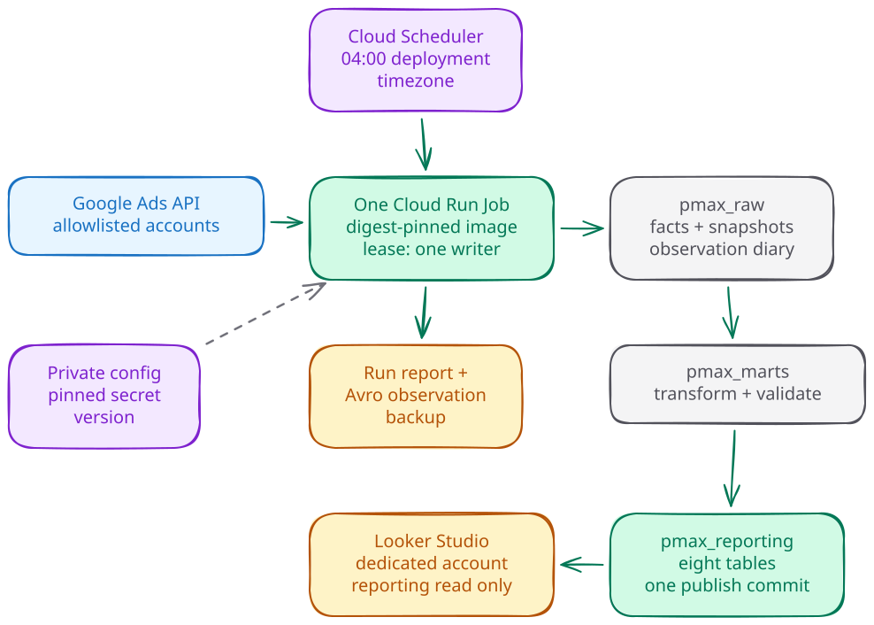
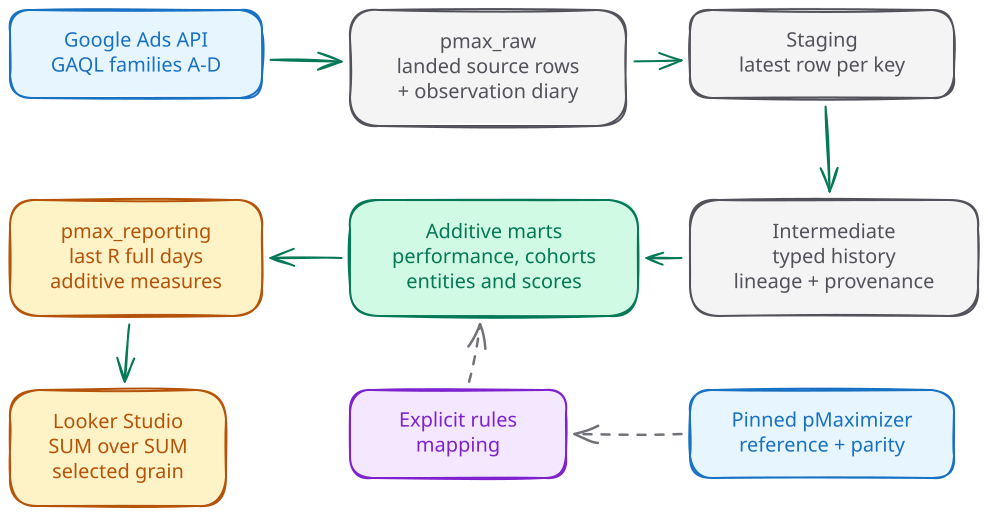
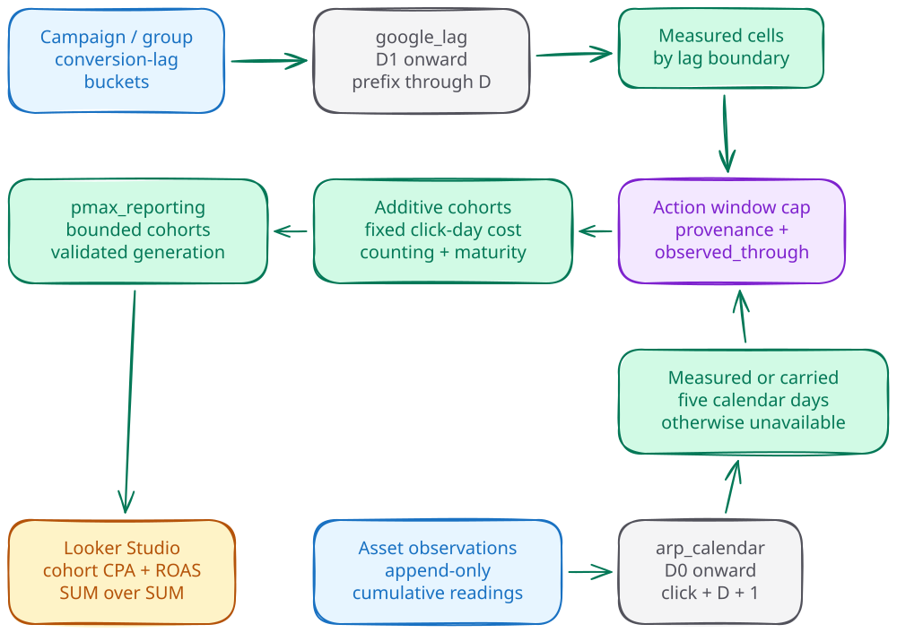
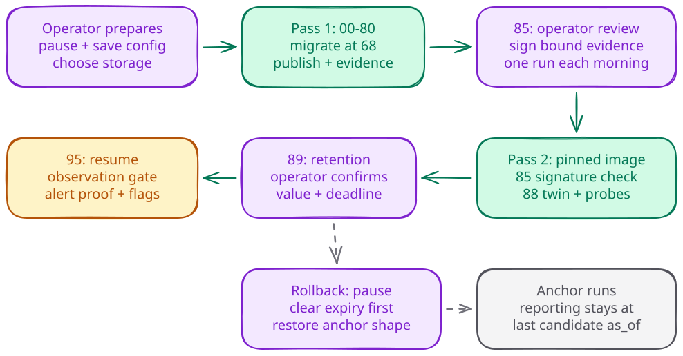

# pMax Performance Pack


An operator-owned Google Ads pipeline for BigQuery, with campaign truth, asset
diagnostics, cohort CPA and ROAS, and a report explaining what each run could prove.

v2.1.0 publishes eight tables for Looker Studio. They hold the configured
reporting window, fully restated each night, while the operator chooses whether
older click-day history expires or accumulates. One Cloud Run Job owns
extraction, validation, publication, and the run ledger.

## Start here

| You want to... | Read |
|---|---|
| Understand the layers, grains, money, and lineage | [Data model](docs/data-model.md) |
| Interpret a D0 or D7 cell and its missing-data state | [Cohorts](docs/cohorts.md) |
| Choose a storage mode and understand what can be lost | [Storage](docs/storage.md) |
| Connect a report and build its calculated fields | [Looker Studio](docs/looker.md) |
| Diagnose a run, rebuild history, or respond to an incident | [Operations](docs/operations.md) |
| Upgrade an existing deployment | [v2.1.0 migration](docs/migrations/v2.1.0.md) |
| Review permissions or release changes | [IAM](deploy/iam.md) · [Release notes](docs/releases/v2.1.0.md) |

## What you get

Extraction covers an explicit account allowlist, and each output identifies
the source and build that produced it.

| Capability | Delivered behavior |
|---|---|
| Reporting | Eight materialized tables in `pmax_reporting`, restricted to the last `reporting_window_days` full click days. The default is 90. |
| Campaign truth | Campaign-level cost, clicks, impressions, and conversions, kept separate from asset attribution. |
| Asset diagnosis | Asset and asset-group facts, entity history, eligibility reasons, creative attributes, and best-practice score marts. |
| Cohorts | Campaign and asset-group lag ladders plus asset observation ladders, with explicit `cohort_counting`, provenance, maturity, and unavailable reasons. |
| History | `window` storage expires old click-day partitions; `incremental` storage retains them and resumes monthly extraction chunks. |
| Operations | Lease protection, transactional replacements, digest and secret-version pins, run reports, audit evidence, and a deployment ladder (the phased sequence that `deploy/deploy.sh` runs) with an operator review. |

This is an independent runtime. pMaximizer is Google's open-source set of
Performance Max reporting queries; the pin is the fixed upstream commit that
the parity tests compare against, recorded in
[PIN.md](src/pmax_pack/reference/pmaximizer/PIN.md). The pinned pMaximizer
queries and rules mapping remain attributed and testable through parity; the
daily marts do not execute Google's upstream chain. The App Reporting Pack (ARP) informs the reporting
window and asset-day labels but is not a runtime dependency. The exact upstream
mapping and its deliberate omissions are in the [data model](docs/data-model.md#current-fork-transformation-mapping).

## Architecture

Cloud Scheduler starts the private Cloud Run Job at 04:00 in the deployment
timezone (`timezone_override`). The Job reads private YAML configuration and a numeric
Secret Manager version, then acquires the single-writer lease. A competing
execution records `SKIPPED` and performs no stages.



[Editable architecture scene](docs/diagrams/architecture.excalidraw)

The datasets have distinct readers and lifetimes:

| Dataset | Role |
|---|---|
| `pmax_raw` | Landed fact partitions, entity snapshots, and the append-only observation diary. |
| `pmax_marts` | Staging, typed intermediates, additive marts, entity history, and score marts. |
| `pmax_reporting` | The eight dashboard tables. The Looker account's only data grant is here. |
| `pmax_ops` | Run and stage evidence, assertions, and extraction checkpoints. |
| `pmax_marts_verify`, `pmax_reporting_verify` | The paired rebuild and migration rehearsal destinations. |
| Snapshot and parity datasets | Upgrade evidence and isolated comparison work, with their own access boundaries. |

A reporting publication first prepares table schemas, then replaces the eight
table contents in one transaction. A HARD validation failure prevents that
publication: marts may contain the attempted generation, while readers retain
the previous reporting generation. The SQL uses BigQuery's
[atomic multi-table transaction support](https://docs.cloud.google.com/bigquery/docs/transactions).
A dashboard can still show cached results or separate charts queried on opposite
sides of the commit. Compare both `as_of` and `run_id` after refreshing every
source, and configure freshness as described
in the [Looker guide](docs/looker.md).

## The nightly data path


[Editable daily-run scene](docs/diagrams/daily-run.excalidraw)

The shared stage order is:

```text
extract -> load -> observe -> backfill -> score -> lag -> cohort
        -> validate -> publish -> report
```

Extraction runs the 17 queries through a bounded pool and spools rows per table.
No load begins until extraction succeeds for every required account. Each fact
table then gets one landing load and its own transactional range replacement;
entity snapshot loads share the pool. The replacement clears empty days inside
the fetched interval and leaves trailing days outside it untouched. Landing
tables have a 24-hour expiration and a guarded cleanup path.

The observe stage appends readings before the optional history backfill. In
`window` mode that backfill stage records zero pending chunks. In `incremental`
mode it resumes unfinished monthly chunks, recording a checkpoint only after a
successful swap. Ready transforms can run together within a stage; dependencies
and stage boundaries still determine execution order. For troubleshooting,
`--serial` runs transforms, assertions, and report collectors one at a time.

The nightly pull and click-keyed transforms include the partial run day:
`as_of - R` through `as_of`, where `R = reporting_window_days`. Reporting
publication excludes that partial day and exposes `as_of - R` through
`as_of - 1`. Enlarging a rebuild's `--window-start` can derive older marts,
but does not enlarge the reporting tables.

## Read the right grain



[Editable data-model scene](docs/diagrams/data-model.excalidraw)

| Reporting table | Use it for |
|---|---|
| `performance_campaign` | Campaign metrics by network and metric basis. |
| `performance_asset_group` | Asset-group metrics at the same additive basis. |
| `performance_asset` | Asset-link metrics, including field type. |
| `asset_performance` | Asset detail with eligibility and creative attributes. |
| `campaign_truth` | Campaign totals from the campaign report. |
| `cohort_campaign` | Campaign conversion-lag cohorts. |
| `cohort_asset_group` | Asset-group conversion-lag cohorts. |
| `cohort_asset` | Asset cohorts from the observation diary. |

Internal `v_int_entities_*` views supply the transform graph. Create CPA,
ROAS, and CTR from the reporting
tables using the [tested calculated-field recipes](docs/data-model.md#looker-studio-calculated-fields).

For example, costs of 10 and 90 with conversion counts of 1 and 3 produce
CPA `(10 + 90) / (1 + 3) = 25`. A zero denominator returns NULL. Select one
currency, and do not combine NETWORK measures with CONVERSION_ACTION measures.
Cost is not allocated to individual conversion actions in performance tables.
Asset attribution does not sum to campaign truth; use `campaign_truth` for the
campaign total.

The PRIMARY conversion basis is the campaign's conversion goals as Google
applies them, decomposed exactly by action; [What PRIMARY means](docs/data-model.md#what-primary-means)
defines its scope and the limits of goal evidence.

## Cohort CPA and ROAS



[Editable cohort scene](docs/diagrams/cohort-mechanism.excalidraw)

`cohort_counting` identifies the convention: `google_lag` for campaign and
asset-group rows, `arp_calendar` for asset rows. The default ladder is
`[0, 1, 3, 5, 7, 14, 30]`; D0 applies only to assets. The exact day mapping,
window edge, and worked example have one definition in
[the cohort guide](docs/cohorts.md).

An action's click-through window caps its ladder and contributes a final window
rung. An asset observation can carry the preceding non-seed reading for at most
five calendar days. Missing readings remain `unavailable` when that rule cannot resolve
them. Calendar age alone never establishes completeness: inspect
`observed_through`, `maturity`, `provenance`, and `unavailable_reason`.

Filter a cohort chart to one counting convention, rung, and metric basis, or
keep them as chart dimensions; never aggregate across them.
Click-day cost repeats across those dimensions. Publication excludes NULL-cost
cells; the operator report retains the diagnostics explaining those omissions.
Older incremental rows that have not been restated can retain NULL
`cohort_counting` and their old labels.

## Choose storage before deployment


[Editable storage scene](docs/diagrams/storage-tiers.excalidraw)

| Choice | `window` | `incremental` |
|---|---|---|
| Older click-day history | Expires at `R + 1` days by partition boundary. | Retained without partition expiration. |
| Monthly history backfill | No pending chunks. | Resumes pending chunks from the configured start. |
| `start_date` | Ignored, with a warning if supplied. | Must be month-aligned; an omitted start is the first day of the month containing the run date minus `reporting_window_days`. |
| Dashboard coverage | Last R full click days. | Last R full click days. |
| Entity snapshots and observations | Never automatically expired by this rule. | Never automatically expired by this rule. |

The additional day protects the oldest partition during the run. Retention
follows the partition column, not a table-name prefix: `snapshot_date` and
`observed_date` are preserved. The reporting and operations datasets never
receive the click-day expiration rule.

Switching from incremental to window can remove accumulated history.
Switching back does not restore deleted data. Parked, unmodified BigQuery
partitions can qualify for long-term storage pricing after 90 days; reads do
not reset that timer. Use the region selector on
[BigQuery pricing](https://cloud.google.com/bigquery/pricing) for the deployment's
storage model and location. The [storage guide](docs/storage.md) explains the
retention evidence and recovery limits.

The [observation bound](docs/cohorts.md#how-much-observation-history-is-collected)
is also a permanent-loss decision. A larger reporting window later cannot
reconstruct what Google reported on a day the pack did not observe.

## Deploy and upgrade

Start with [config/example.yaml](config/example.yaml). Deployment requires
Python 3.12 through `uv`, Google Cloud CLI and `bq`, the Docker CLI with buildx (image inspection only; builds run in Cloud Build unless `PMAX_BUILD_MODE=local`), an existing
billed project, and an explicit deployment timezone. The ladder checks the
project's organization parent, `app=pmax` label, region, and the enforced
`iam.disableServiceAccountKeyCreation` policy. Keep the Google Ads credential
file outside the repository.

Configuration uses string dataset identifiers and explicit principals:

```yaml
storage: window
reporting_window_days: 90
cohort_days: [0, 1, 3, 5, 7, 14, 30]
restatement_margin_days: 7
env: prod
datasets:
  reporting: "pmax_reporting"
  reporting_verify: "pmax_reporting_verify"
editors:
  - "user:editor@example.com"
looker_service_agents: [] # Populate with the service agent from each editor organization.
```

This is an excerpt, not a complete deployable config. The [Looker guide](docs/looker.md)
explains how to obtain the organization-specific agent principals and grant
editor access before editing a data source. There is no personal-credentials
mode.

Set `REGION` from the validated config as described in the
[migration's invocation convention](docs/migrations/v2.1.0.md#invocation-convention).
Preview the deployment ladder:

```bash
export PMAX_PROJECT_ID="your-gcp-project-id"
export PMAX_CONFIG_BUCKET="your-private-config-bucket"
export PMAX_CONFIG_FILE="/secure/path/deployment.yaml"
export PMAX_CREDENTIAL_FILE="/secure/path/google-ads.yaml"

bash deploy/deploy.sh \
  --project "$PMAX_PROJECT_ID" \
  --region "$REGION" \
  --config-uri "gs://$PMAX_CONFIG_BUCKET/deployment.yaml" \
  --config-file "$PMAX_CONFIG_FILE" \
  --credential-file "$PMAX_CREDENTIAL_FILE" \
  --plan
```

Also supply `PMAX_DEPLOYER_MEMBER`, `PMAX_OPERATOR_MEMBER`,
`PMAX_GITHUB_REPOSITORY_ID`, `PMAX_GITHUB_OWNER_ID`, and
`PMAX_OAUTH_PUBLISHING_STATUS` as described in
[Bootstrap inputs](deploy/iam.md#bootstrap-inputs).

`--plan` performs read-only target checks and resolves the ladder generation
without writing it. `--plan` prints configured principals, including editor
addresses; never commit it. Keep that output private.
Never use `--yes`. Human-run phases require the operator's exact
`PMAX_CONFIRMED_PHASES` entries when invoked without a TTY. Phase 85 may never
appear in that list. Only the operator authors `PMAX_SIGNED_REVIEW`.



[Editable upgrade scene](docs/diagrams/upgrade-sequence.excalidraw)

| Step | Evidence and result |
|---|---|
| Operator preparation | Pause scheduling, preserve the previous config, choose storage, and read the migration procedure. An upgrade requires an explicit storage choice. |
| Pass 1 through 80 | Provision and record the candidate, migrate at 68, rebuild and publish at 70, exercise the lease at 75, pre-check reporting reads, and stop at phase 80 for the operator to run the live printed LOCAL parity command before collecting parity evidence. |
| Stop at 85 | Review the exact run, image, report, and parity evidence. Perform and record one manual run each scheduled morning in the deployment timezone while paused. |
| Signed pass | Supply the candidate digest through `PMAX_IMAGE_REF`, validate the review, rehearse against the twin at 88, apply operator-confirmed retention at 89, prove alerts, and pass the phase-95 observation gate before resuming. |

Follow [the migration procedure](docs/migrations/v2.1.0.md) for retries,
continuations, required evidence, and rollback. An explicit image pin wins;
automatic reuse of an unfinished generation requires the same repository HEAD
within seven days. A rollback returns to the anchor, the recorded prior release
image and its source checkout; it must clear expiration and restore the anchor's
schema and config before running its own ladder. The anchor does not publish
to `pmax_reporting`, so dashboards remain at the last candidate `as_of`.

## Cost and runtime budget

Fact loads use one landing load and swap per table, ready transforms run
concurrently, and report collection is pooled, which keeps submitted jobs and
idle waits between independent steps low. The deployment's
first two scheduled reports establish the measured baseline. The first reading
is expected above the 120-second stage-span target; that target is informational
and excludes startup and tail work.

The report separates startup, stage span, tail, and process total, with job
submissions, rows loaded, and load-path jobs. Process timing begins at CLI entry
and excludes the final report upload; compare it with Cloud Run execution
timestamps to understand time outside that interval. `Total jobs` counts
submissions, so reconciliation against `JOBS_BY_PROJECT` filters
`parent_job_id IS NULL` plus the run label. That recipe applies to real nightly
runs, not rebuild dry runs. See [operations](docs/operations.md) for the query.

Looker queries bill to the client project. Dataset grants bound the data they
can read; under on-demand pricing, the project's configured
[per-user daily query quota](https://docs.cloud.google.com/bigquery/docs/custom-quotas)
bounds usage. The operator sets that quota from a measured estimate in phase 45,
as described in [IAM](deploy/iam.md). Review Cloud Billing by environment and
application labels alongside run budgets; a runtime target is not a spending
cap.

Before widening a window, run a cost dry run against the verification pair:

```bash
uv run pmax-pack rebuild \
  --as-of 2026-09-25 \
  --target-dataset pmax_marts_verify \
  --dry-run
```

The command uses the configured reporting window and does not publish data.
Its older-`as_of` publication guard is recorded as `not evaluated (dry run)`;
a real rebuild can still refuse to replace newer reporting data. Targeting the
live marts uses the production lease. See [operations](docs/operations.md)
before using `--allow-older-as-of` or `--window-start`.

## Read the run report

Each run writes its report to `reports/<deployment>/<run_id>.md`. An executed
daily `run`, whether PASS or FAIL, advances `latest.md`. SKIPPED runs, rebuilds,
and backfills leave that pointer unchanged.

| Signal | Operator interpretation |
|---|---|
| HARD assertion failure | The candidate was not published. Start with the named assertion and keep the previous reporting generation available. |
| SOFT finding | Read the affected grain, date range, and reason; publication can proceed. |
| `unavailable` cohort cells | Check first-snapshot coverage, seed-only readings, carry gaps, and the reporting-window cap. |
| Pending incremental chunks | History extraction is incomplete; compare `pending_before` and `pending_after`. |
| Retention drift | Reconcile table options through [the operator procedure](docs/data-model.md#operator-command-used-by-the-ladder); the runtime reports drift and does not apply ALTERs. |
| Mixed chart generations | Refresh every source and compare both `as_of` and `run_id` before diagnosing a data reconciliation defect. |

Raw and observation data contains aggregate advertising performance and entity
configuration, not end-user identifiers. Access, sharing, revocation, and the
three incident-deletion cases are defined in [operations](docs/operations.md).
The observation Avro copies have a separate lifetime from report objects.

## Local verification

```bash
uv sync --locked
uv run pytest -q
make deploy-test
uv run python scripts/lint_dataset_refs.py
uv run python scripts/scrub_check.py .
```

Pull-request CI uses sanitized fixtures and read-only repository permissions,
without Google Ads or GCP credentials. SQL checks render and parse the manifest,
audit dependencies, and pin known partition-filter warnings. The partition
lint is advisory for documented warnings; an undocumented warning fails the
pin. Its scope is rendered manifest SQL, not SQL embedded in Python.

The diagram builder lives in [docs/diagrams/build.py](docs/diagrams/build.py).
It creates the editable Excalidraw scenes and the SVG and PNG exports, checks
layout and font embedding, and restores the canvas it used. Diagram exports and
visual QA are part of the release review.

## License and attribution

Apache-2.0. See [LICENSE](LICENSE) and [NOTICE](NOTICE). Pinned Google reference
queries retain their upstream attribution and remain separate from the pack's
runtime code.
