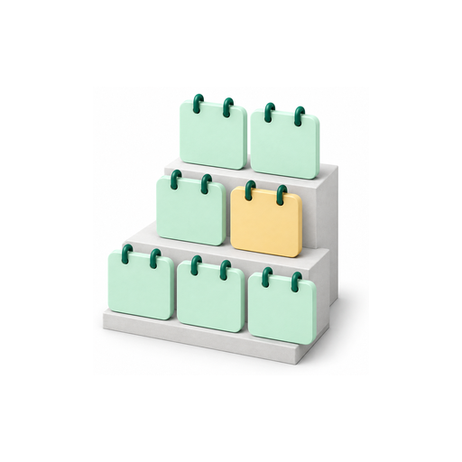

# Cohort CPA and ROAS



The cohort model keeps one additive row per click date, entity, network,
conversion basis, and cohort rung. Campaign and asset-group history comes from
Google's conversion-lag buckets. Asset history starts with the first successful
snapshot and comes from the append-only observation log. The pack never
forecasts a cell. Bucket-prefix rungs exclude unknown lag; an uncapped final
rung between bucket boundaries uses the complete click-day total.


## Counting and reading dates

One `cohort_days` ladder, default `[0, 1, 3, 5, 7, 14, 30]`, serves all
three grains. Asset rows use `cohort_counting = 'arp_calendar'`: D0 is the
click day read the following morning, and Dk reads morning k+1 after the click
day. Campaign and asset-group rows use `cohort_counting = 'google_lag'`: Dk
sums Google's lag buckets through day k, and these marts have no D0. Because
of that one-day difference, an asset D0 reading aligns with Google lag D1,
and the pack compares observation rung k with lag rung k+1 wherever both are
configured. Asset-group observations exist internally for that reconciliation;
the asset-group mart itself uses Google lag counting.

An exact observation is `measured`. If its target reading was missed, a prior
non-seed observation can be `carried` across at most five calendar days.
`observed_through` identifies the earlier observation date in the deployment
timezone (`timezone_override`) as a timestamp at local midnight; the source log has no sub-day precision. The seed
observation is the reading taken on the account's first successful snapshot
date. A seed observation can supply an exact cell, but is never carried. The first eligible D0 click
day is the day before the account's first successful snapshot.

The [query-family definitions](data-model.md#query-families) identify the
extraction streams used below.

Google lag bucket-prefix cells carry the family C load timestamp as
`observed_through`. An uncapped non-boundary final rung instead uses family A
for aggregate bases or family B for named actions. That total stream supplies
the refresh date, `observed_through`, source run, and maturity evidence.
Lag classification and the cumulative value visible on a run date can differ,
so comparisons preserve `provenance`, `maturity`, and `observed_through`.
The SOFT reconciliation assertion reports D0/D1 deviation and deeper-pair
divergence separately; publication proceeds. The default ladder supplies the
D0/D1 pair and has no deeper consecutive pair. A ladder with no configured
consecutive pair produces a SOFT warning:
`no reconciliation pair in the configured ladder`.

Every cohort row written or restated by v2.1.0 carries `cohort_counting`.
In incremental storage, pre-v2.1.0 rows outside the re-pull window retain NULL
and their original labels until restated. Keep that dimension when comparing
history with newly written cells.

## Conversion bases and windows

Every grain can expose three conversion bases:

- `PRIMARY` is the campaign's conversion goals as Google applies them,
  decomposed exactly by action; see [What PRIMARY means](data-model.md#what-primary-means).
- `ALL_CONVERSIONS` uses the all-conversions basis and the longest contributing
  action window.
- `CONVERSION_ACTION` keeps each named action separate.

Configured rungs may include D0 and the exact Google bucket boundaries:
D1 through D14, D21, D30, D45, D60, or D90. Each action's click-through
lookback window caps its ladder. The final rung is the smaller of the action
window and `reporting_window_days`, labelled `D<window> window`; configured
days beyond it do not exist. An action window longer than the reporting
window carries `window_provenance = 'capped by reporting window'`.

At asset grain, an action window equal to the reporting window also carries
that provenance. A rung whose target reading falls beyond the reporting
interval resolves `unavailable`, with `unavailable_reason = 'capped by
reporting window'`. The final rung is retained once the last accessible
morning arrives, even though its own reading cannot be fetched. The last
measurable asset rung is one day below the reporting window. Set
`reporting_window_days` to at least the longest action window plus one to
make that action's final asset rung measurable.

### Worked example: a 30-day reporting window

Assume `reporting_window_days: 30` and the default ladder. A 90-day action
and a 30-day action both end at the visible D30 window rung.

| Action window | Final campaign and asset-group rung | Asset final rung | Last measurable asset rung |
|---|---|---|---|
| 90 days | Measured bucket prefix; window provenance is `capped by reporting window`. | D30 remains visible, metrics NULL, reason `capped by reporting window`. | D29 is the last measurable age; D14 is the last configured rung in the default ladder. |
| 30 days | Measured bucket prefix; window provenance is `observed` when the window came from an on-time snapshot. | Same D30 cap and NULL metrics as the 90-day action. | D29 by age; D14 in the default ladder. |
| 7 days | Measured D7 window rung using the bucket prefix. | Measured D7 window rung at its target reading. | D7, since the action window ends the ladder. |

For a concrete asset click day of 2026-09-01, the 30-day reporting window
still includes that click day on the 2026-10-01 run. The capped D30 row is
shown then; the required 2026-10-02 reading lies outside the accessible
interval. Increasing the reporting window to 31 makes a 30-day action's
final asset rung measurable prospectively. A 90-day action needs at least 91.
A later increase cannot recreate a historical morning that was never saved.

For Google lag grains, an uncapped action window on a bucket boundary uses
the bucket prefix. An uncapped non-boundary action window uses Google's
click-day conversion total from family A for aggregate bases and family B
for a named action. Config parsing warns, without refusing the config, when
`reporting_window_days` is smaller than the largest configured rung plus one
plus `restatement_margin_days`. A 14-day reporting window with D30 configured
therefore warns and trims the ladder. If the reporting window is not a Google
bucket boundary, config parsing also warns, and the final campaign and
asset-group rung for an action at or beyond that cap stays visible with
`window_provenance = 'capped by reporting window'`, NULL cohorted metrics, and
`unavailable_reason = 'reporting window is not a lag bucket boundary'`.

For click dates before the first entity snapshot, the first snapshot's window
is used with `window_provenance = 'assumed-current'`. Later click dates use the
window observed on the click date and carry `window_provenance = 'observed'`.
The reporting cap described above takes precedence over either source label.

## Provenance and maturity

Every cell has one provenance:

- `measured`: supplied by a bucket prefix, the uncapped final-window total,
  or an exact observation day.
- `carried`: supplied by the prior non-seed observation, with a gap of no more
  than five calendar days.
- `unavailable`: no value is supplied. `unavailable_reason` is `before first
  snapshot`, `first snapshot unknown`, `gap exceeded`, `seed only`,
  `capped by reporting window`, or `reporting window is not a lag bucket boundary`.

A cell is `complete` when the selected source stream has refreshed on or
after its target reading date under the counting above. A carried snapshot
cell becomes complete once a later selected observation reaches the target
day, even though `observed_through` continues to identify the earlier
observation that supplied the value. A frozen stream never advances that
evidence bound, so its existing bucket cells remain `immature`.
`stale_cell_count` makes immature cells
countable in reports. Unavailable cells have NULL maturity and contribute
zero to `stale_cell_count`; reports list them as gaps without also listing them
as stale.

Measurable snapshot rows are materialized only through the account's latest
successful observation date. A future target is absent; the capped final
rung described above is the exception. Within the evidence bound, exact-day
observations are measured, a prior non-seed observation can be carried for
at most five calendar days, and every other gap is unavailable. The runtime
restates the reporting interval in one transaction per manifest step
(usually one table).

## How much observation history is collected

Let `R` be `reporting_window_days`, `K` the largest configured rung, `W` the
longest action window from the latest complete family-D snapshots, and `M`
`restatement_margin_days`. The runtime chooses the observation bound:

```text
bound = min(R, max(K + 1, W + 1) + M)
```

All actions with a window contribute to this ceiling, including hidden or
removed actions in the source snapshot. If the family-D evidence is absent
or incomplete across accounts, the fallback is `min(R, K + 1 + M)`.
For each observation date in the deployment timezone, collection covers click
dates from `observed_date - bound` through `observed_date - 1`, further clamped
to the interval actually fetched. It never records the partial observation day.

With a 30-day largest rung, a 90-day action, a seven-day margin, and `R = 120`,
the bound is 98 days. With `R = 30`, it is 30. Reports distinguish the fixed
`reporting_window` used for re-pulls from the `family_d` or `config_fallback`
source used for the observation bound.

The per-action warning describes two losses. `unmeasurable rungs` identifies
asset ages whose reading cannot be collected; `full-margin coverage lost`
identifies ages for which the whole configured restatement margin is not
available. For a 90-day action with a seven-day margin:

| Reporting days | Unmeasurable asset ages | Ages losing full-margin coverage |
|---|---|---|
| 30 | D30-D90 | D23-D90 |
| 90 | D90-D90 | D83-D90 |
| 97 | None | D90-D90 |
| 98 | None | None; no forfeited-action warning. |

These are age ranges; not every integer in them is a configured rung.
Choosing a smaller observation bound is a permanent-loss decision: Google can supply
restated click-day totals later, but cannot replay the value visible on a
missed morning. [Storage and recovery](storage.md) explains the consequences.

## Publication and freshness

For a real production rebuild, the older-as-of check runs once after lease
acquisition and before the score stage or any mart rewrite; a verification
rebuild takes no lease and runs the check first, also before the score stage or
any mart rewrite.
The publish stage records that decision without repeating the check; the
production lease excludes a concurrent publish.

`rebuild --as-of` checks the entire reporting
`campaign_truth` table, which is already window-bounded, using a nominal
full-domain date predicate. It refuses to replace a newer generation unless
`--allow-older-as-of` is explicit, and it records the decision in the publish
stage detail.

Freshness uses the configured ladder at each grain: the asset mart expects
click dates through `as_of - (min(cohort_days) + 1)`; the campaign and
asset-group marts expect `as_of - min(positive cohort_days)`. All three expect
yesterday under the default ladder. With `[3, 5]`, the asset expectation is
four days back and the Google lag expectation three days back. A D0-only
ladder has no configured freshness target for Google lag grains, whose final
rungs then depend on individual action windows. Their freshness rows display
`no configured expectation (ladder has no positive rung)` with INFO status.

## Additive marts and reporting ratios

`mart_cohort_campaign`, `mart_cohort_asset_group`, and `mart_cohort_asset`
contain only additive components and dimensions. Cost is fixed at the click
date and joined from family A at the matching entity and network grain.
`missing_cost_cell_count` is one when a cohort cell has no click-day cost.

Publication into `pmax_reporting.cohort_campaign`, `cohort_asset_group`,
and `cohort_asset` excludes missing-cost cells. Looker calculated fields then
calculate ratios after aggregation:

- cohort CPA = `SUM(click_day_cost) / SUM(cohorted_conversions)`
- cohort ROAS = `SUM(cohorted_value) / SUM(click_day_cost)`

The reporting tables expose maturity; they do not filter it. Keep `maturity`
visible or filter it explicitly so an immature tail cannot slip unnoticed into
a complete ratio. Filter to one counting convention, rung, and metric basis,
or keep them as chart dimensions; never aggregate across them. Each grain has
one `cohort_counting` convention. Keep the action resource name when comparing
named actions. Cost repeats across rungs and bases. The [Looker guide](looker.md) includes
the zero guards and source-by-source recipes.

## Unknown lag

`unknown_lag_conversions` and `unknown_lag_value` retain Google's `UNKNOWN` and
any unrecognized lag bucket. Those values are repeated as diagnostics at each
rung for the same grain and basis. Bucket-prefix rungs exclude unknown lag
from `cohorted_conversions` and `cohorted_value`. An uncapped non-boundary final
rung uses the complete family A or B click-day total without a lag filter,
so that total can include unknown-lag conversions and value. Do not add the
diagnostic to a cohort value or sum it across different cohort days.
