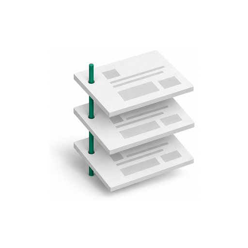

# Performance Pack data model

The v2.1.0 model separates landed Google Ads data, typed history, additive
marts, and the materialized reporting tables used by dashboards. Click-day
facts partition on `date` or `click_date`, entities on `snapshot_date`, and
the observation log on `observed_date`. Tables cluster first by `account_id`,
then `campaign_id` and the grain key where available. The physical DDL defines
the complete partition and clustering contract.

| Layer | Dataset | Reader and purpose |
|---|---|---|
| Landed facts and snapshots | `pmax_raw` | Runtime and operator; source records, extraction lineage, and append-only observations. |
| Staging and intermediate tables | `pmax_marts` | Runtime and operator; deduplication, as-of entity joins, windows, and cohort cells. |
| Additive marts | `pmax_marts` | Runtime and operator; performance, best-practice scores, and cohorts. |
| Published tables | `pmax_reporting` | Dedicated Looker reader; eight tables containing the last validated reporting window. |
| Run evidence | `pmax_ops` | Runtime and operator; runs, stages, checkpoints, and checks. |

These are the default dataset identifiers; a deployment can override them.
Marts do not require a partition filter. Runtime query jobs carry a bytes cap.
The rendered-manifest partition lint is advisory for its documented warnings,
and it does not inspect SQL embedded in Python, so a query outside that
manifest needs its own review of partition predicates.

Use the [Looker guide](looker.md) to connect a report and the
[storage guide](storage.md) to choose retention. The schema and ratio contracts
below explain what those readers may safely aggregate.

## Query families

The [extractor's query catalog](../src/pmax_pack/extract.py) groups the 17
Google Ads Query Language (GAQL) queries into four families. The filenames
below are in the shipped [queries directory](../src/pmax_pack/queries/).

| Family | Source measures or settings | Query files |
|---|---|---|
| A | Volume facts by click date and network at campaign, asset-group and asset-link grain: impressions, clicks, cost, and aggregate conversion counts and values. | `volume_campaign.sql`, `volume_asset_group.sql`, `volume_asset.sql` |
| B | Conversion counts and values split by conversion action, click date and network at campaign, asset-group and asset-link grain. These queries do not select cost, clicks or impressions. | `conv_campaign.sql`, `conv_asset_group.sql`, `conv_asset.sql` |
| C | Conversion counts and values split by conversion action and lag bucket, click date and network at campaign and asset-group grain. | `lag_campaign.sql`, `lag_asset_group.sql` |
| D | Entity and configuration snapshots: campaigns, asset groups and links, asset details, signals, campaign/customer asset links, conversion actions and customer settings. | `entities_campaign.sql`, `entities_asset_group.sql`, `entities_asset_group_asset.sql`, `entities_asset.sql`, `entities_asset_group_signal.sql`, `entities_campaign_asset.sql`, `entities_customer_asset.sql`, `entities_conversion_action.sql`, `entities_customer.sql` |

Families A, B and C query a date range. Family D reads current entity settings
for the run's snapshot rather than backdating them into historical chunks.

## Contract rules

- A click-keyed step replaces the inclusive window from
  `@as_of - window_days` through `@as_of` in one transaction per manifest
  step (usually one table). Entity snapshot steps replace only the
  `snapshot_date = @as_of` partition. Views
  and DDL remain unparameterized.
- Raw and staging money remains `INT64` micros. Published `network_cost` and
  `budget_amount` are `NUMERIC` currency amounts derived by dividing micros by
  1,000,000. `currency_code` states the account currency.
- Performance marts use `metric_basis`. `NETWORK` rows populate only the
  `network_*` group. `CONVERSION_ACTION` rows populate only the `action_*`
  group. Never sum those column groups together.
- A conversion action row keeps `ad_network_type` as a dimension but does not
  repeat cost, clicks, or impressions. The pack does not allocate cost to an
  action.
- Marts and reporting tables carry additive measures; ratios are Looker Studio
  calculated fields computed after aggregation: `SUM(numerator)` divided by
  `SUM(denominator)`.
- Entity attributes join to a click day using the most recent complete
  snapshot on or before that day. Click days before the first complete
  snapshot use the first snapshot and set `attribute_provenance` to
  `assumed-current`.
- Per-day `int_entities_*` tables store observed rows and inferred tombstones.
  Their seen-bound columns stay null. The derived current-value views named
  `v_int_entities_*` calculate `first_seen_date` and `last_seen_date` across
  every complete snapshot day, so a prior-day reader sees a later observation
  immediately and no historical partition stores a stale bound.
- `observed` means the attribute came from the selected snapshot.
  `inferred-removed` means the entity was present on one complete day and
  absent on the next complete day. `unavailable` means no entity snapshot was
  available for the join.
- `url_expansion_opt_out` remains nullable. The shipped
  [campaign extraction query](../src/pmax_pack/queries/entities_campaign.sql)
  omits it after the [recorded production extraction rejection on 2026-08-26](../src/pmax_pack/reference/pmaximizer/PIN.md#harness-api-version).
  The schema retains the field as a nullable boolean; the production model
  does not derive a replacement value.
- The pack never sums asset rows to campaign totals. For dashboard campaign
  totals use `pmax_reporting.campaign_truth`, which is sourced from
  `mart_campaign_truth`.

Changing a partition or clustering specification requires a migration that
drops and recreates the affected `pmax_marts` table, because the runtime's
`CREATE TABLE IF NOT EXISTS` DDL does not update an existing table and
BigQuery sets a table's partitioning strategy when the table is created
([partitioned table limitations](https://docs.cloud.google.com/bigquery/docs/partitioned-tables#limitations)).
Do not use `CREATE OR REPLACE` to change either specification.

The manifest records per-step clustering metadata as a scheduling and review
simplification. A step that creates several physical staging or intermediate
tables declares the shared leading keys there, while each table's SQL DDL
states its complete clustering list.

## What PRIMARY means

The PRIMARY conversion basis is the campaign's conversion goals as Google
applies them, decomposed exactly by action. Campaign `conversions` equals the
sum of per-action `conversions` on the same reporting scope. The entity field
`include_in_conversions_metric`
([field reference](https://developers.google.com/google-ads/api/reference/rpc/v25/ConversionAction))
does not predict membership. The product's cohort review evidence of
2026-08-27 records a live run in which an action had nonzero Conversions while
that flag was false, so the pack does not derive membership from it.
The pack extracts no goal resources, so it cannot tell whether a
custom goal or a standard goal switched off caused an observed membership.

Keep this definition separate from the window resolver. To size the PRIMARY
ladder, `int_lookback_windows` accepts a true legacy flag or nonzero family B/C
Conversions as evidence that an action may contribute, then selects the
longest contributing window. It does not use that flag to rewrite Google's
conversion values. Performance `NETWORK` rows hold Google's aggregate
Conversions; `CONVERSION_ACTION` rows hold their action decomposition. Cohort
`PRIMARY` is a conversion basis, while performance `NETWORK` names the metric
family that also carries cost, clicks, and impressions.

For campaign and asset-group cohorts, PRIMARY conversions and value equal the
sum of contributing `CONVERSION_ACTION` rows at the same bucket-prefix rung,
click date, entity, and network, provided every contributing action has that
rung. The [cohort fixture test](../tests/sql/test_cohort_fixture.py) pins this
relation with different action values and windows.
It does not extend the relation to an uncapped non-boundary final rung, which
reads independently refreshed family A/B totals. Cohort cost repeats on every
action row; do not sum it across actions to compare with PRIMARY cost.

## Retention by partition column

`storage: window` retains click-day partitions for
`reporting_window_days + 1` days. The extra day protects the oldest re-pulled
day during the nightly replacement. Expiration is measured from the UTC
partition boundary, not from the row's last write; the [storage guide](storage.md)
explains the slack, switching loss, and long-term storage pricing.
`storage: incremental` keeps every partition. Snapshot history and observation
readings survive in both modes.

| Dataset and partition column | Window mode | Incremental mode |
|---|---|---|
| Raw and marts: `date`, `click_date` | `reporting_window_days + 1` days | Never |
| Raw and marts: `snapshot_date`, `observed_date` | Never | Never |
| Reporting and ops: any column | Never | Never |

The inventory comes from the raw and ops table specs and the manifest's
partition metadata. Every rendered script contributes its physical CREATE
targets, including both `int_lag_prefix_*` tables. A comment-aware tokenizer
refuses unrecognized CREATE statements or unreadable targets, and the test
suite compares its inventory with SQLGlot across the full manifest. Views and
temporary tables do not enter the inventory. CREATE discovery does not support
scripting control-flow blocks, so the manifest inventory test rejects them
before comparison. Discovery examines statement starts, ignores expression
path components and parameters, and skips temporary non-table objects such as
functions. Dataset names follow the configuration rule, including digit-leading
names. Table names follow BigQuery's
[Unicode character categories and 1,024-byte limit](https://docs.cloud.google.com/bigquery/docs/tables#table_naming);
emitted SQL identifiers remain backtick-quoted.

The ladder applies expiration per table. The raw, marts, reporting, and ops
datasets must have no default partition or table expiration. The verify twin
keeps its separate seven-day table default. BigQuery exposes table expiration
defaults as `default_table_expiration_days` in
[`SCHEMATA_OPTIONS`](https://docs.cloud.google.com/bigquery/docs/information-schema-datasets-schemata-options);
the guard also recognizes the API-style `default_table_expiration_ms` name.
The operator command checks dataset defaults through project-scoped metadata
in EU, which matches the deployment ladder's dataset location and is
independent of the Cloud Run region. Runtime jobs require only dataset-scoped
table metadata.

The nightly report compares the expected map with
[`TABLE_OPTIONS`](https://docs.cloud.google.com/bigquery/docs/information-schema-table-options)
in each configured raw, marts, ops, and reporting dataset after the load
stage drops marked, expiring `_pmax_landing_` tables left by other runs (the
orphan sweep). A missing or NULL partition-expiration option means
never. The audit excludes `_pmax_landing_` tables and emits one SOFT
`retention_drift` check naming differing tables. It also reports any non-NULL
`expiration_timestamp`, including on click-day tables, and any expiring table
outside the inventory in all four datasets. Clearing a dataset default does
not remove an existing table expiration. Equal settings produce no drift line.
The report names an unreadable table-option row as drift by table name while
the other rows from that dataset remain available. If a dataset reader fails,
completed comparisons remain in `retention_drift`; tables from the failed
dataset contribute no inferred mismatches. A separate SOFT
`retention_metadata` check names the failed reader and carries a redacted,
single-line error message with markdown pipes escaped. Its availability count
is separate from the mismatch count. The runtime never queries
project-scoped dataset defaults or changes retention. Changing the configured
window therefore requires another ladder run; until then the report warns.

### Operator command used by the ladder

`pmax-pack retention` reads live options, prints the differing tables, displays
the never-expire and dataset-default guard results, and prints the ALTER list.
This preview does not mutate BigQuery. It refuses a list containing any
snapshot, observation, ops, or reporting table, including attempts to clear a
mistaken expiration on those protected classes. It also refuses while a
never-expire table has an `expiration_timestamp`; in incremental mode this
includes click-day tables. The command refuses the whole apply when an
unknown raw or marts table carries any expiration, so no ALTER runs outside
the managed inventory; the runtime still reports that table as drift. An
unreadable option row also blocks the apply. Investigate that drift before
continuing the ladder.

The human-run ladder is the sole caller of `retention --apply`. It supplies
`--confirmed <days>` equal to `reporting_window_days + 1`, or `--confirmed never`
in incremental mode. `PMAX_RETENTION_CONFIRMED` supplies the same value when
the flag is absent. Apply also requires `--digest <image-digest>` (or
`PMAX_IMAGE_DIGEST`), `--record <retention-record-path>`, and
`--phase-88-record <rehearsal-record-path>` in both storage modes. The ladder
owns signature validation, rehearsal, and refusal while a lease or execution
remains live.

For phase 88, add `--target-dataset <configured-marts-verify>` to preview or
apply. Only that configured twin is accepted. Reads and changes then cover
only the marts-side tables in the twin; live datasets are excluded. Its
seven-day table default and inherited whole-table expiration are allowed,
while a default partition expiration is refused. Use a separate twin record
path for rehearsal evidence; live and twin scopes cannot share a record.

Apply acquires a nonblocking record lock before it reads live metadata,
computes differences, checks guards, and submits ALTERs. A concurrent apply
for the same record fails with `already in progress`. Lock files live in
`pmax-retention-locks/` beside the resolved, operator-chosen record file; the
directory must belong to the current user and have mode 0700. After
acquisition, apply refuses a foreign-owned lock descriptor, and the descriptor
must still match the path's inode. Acquisition makes at most three attempts,
including at most two retries for stale handles, before any metadata read.
The owner removes the matching lock file while still holding its lock,
immediately before release, so no lock files remain after completion and an
old descriptor cannot bypass a replacement lock.

Only differing options generate ALTERs, with marts first and raw last.
Incremental mode generates NULL-setting ALTERs for exactly the click-day
tables that still expire, allowing phase 68 to clear them before draining
history. Phase 89 then confirms `never` with an empty list when all settings
already match. BigQuery documents NULL as the value that
[removes partition expiration](https://docs.cloud.google.com/bigquery/docs/managing-partitioned-tables#update_the_partition_expiration).

The JSON record is durable per digest. Before the first ALTER it stores
`original_inventory` with each table's original option, desired option,
timestamp, and rollback deadline. The deadline uses the smaller raw/marts
`max_time_travel_hours` value from dataset metadata; an absent setting uses
BigQuery's [168-hour default](https://docs.cloud.google.com/bigquery/docs/datasets).
The same page allows settings from 48 through 168 hours in multiples of 24;
twin rehearsal uses the twin's setting. The record preserves the original
confirmed value and phase-88 evidence path. Every attempt appends its own
confirmation, storage mode, reporting window, rehearsal path, target scope,
timestamp, status, and successfully altered table list, including no-op
attempts. A later window or storage-mode change under the same digest validates
against the current configuration without replacing the original inventory
or its timestamps. An empty original inventory is the exception: the first
attempt that alters any table seeds it, so an initial incremental no-op can
be followed by a window-mode apply under the same digest. Once populated, a
later change outside that inventory is refused by name before evidence is
rewritten or an ALTER is submitted. A partial failure retains the successful
prefix and a conservative rollback scope.

`pmax-pack retention --rollback <record>` first prints the recorded digest,
original confirmation, project, dataset scope, and live or twin target, then
prints NULL-setting statements for exactly `original_inventory`. New records
store project and dataset scope even when the inventory is empty. For older
records, the header derives scope from the original inventory and marks any
unavailable scope as `unrecorded`. It does not load clients, query live tables,
apply statements, or include tables from appended attempts. Removing expiration
stops further expiry; recovering already expired history follows the migration
appendix's per-table recovery procedure within the recorded deadline.

## Shared column dictionary

| Column | Description |
|---|---|
| `date` | Google Ads click/report day and fact partition. |
| `snapshot_date` | Complete entity extraction day and entity partition. |
| `account_id` | Google Ads customer ID as `INT64`. |
| `campaign_id` | Google Ads campaign ID as `INT64`. |
| `asset_group_id` | Performance Max asset group ID as `INT64`. |
| `asset_id` | Google Ads asset ID as `INT64`. |
| `source_run_id` | Extraction run that supplied the selected landed row. |
| `built_by_run_id` / `run_id` | Model run that built the intermediate or published row. |
| `metric_basis` | `NETWORK` or `CONVERSION_ACTION`; identifies the populated additive group. |
| `ad_network_type` | Google Ads network segment. |
| `conversion_action_id` | Numeric ID parsed from the conversion action resource name. Null on network rows. |
| `conversion_action_resource_name` | Full conversion action resource name. It remains in the grain so two malformed or temporarily unparseable IDs cannot collapse. Null on network rows. |
| `conversion_action_name` | Google Ads conversion action display name. |
| `network_impressions` | Impressions from the network-segmented report. |
| `network_clicks` | Clicks from the network-segmented report. |
| `network_cost` | Account-currency cost derived from micros. |
| `network_conversions` / `network_conversions_value` | Primary conversion count and value from the network report. |
| `network_all_conversions` / `network_all_conversions_value` | All-conversion count and value from the network report. |
| `action_conversions` / `action_conversions_value` | Primary conversion count and value for one conversion action. |
| `action_all_conversions` / `action_all_conversions_value` | All-conversion count and value for one conversion action. |
| `currency_code` | ISO account currency from the customer snapshot. |
| `time_zone` | Google Ads account timezone. |
| `attribute_provenance` | `observed`, `assumed-current`, `inferred-removed`, or `unavailable`. |
| `first_seen_date` / `last_seen_date` | First and last complete snapshot days on which the entity was observed, derived by the current-value `v_int_entities_*` views. |
| `inferred_removed` | True only on the first complete day after the entity was last observed. |
| `primary_status` | Google Ads eligibility status. It is the asset eligibility source. |
| `primary_status_reasons` | Repeated Google Ads eligibility reasons. |

## Staging tables

Each click-keyed staging table selects the latest `(loaded_at, run_id)` for its
stated key inside the effective re-pull window. Entity staging selects the
single `@as_of` snapshot. Staging retains raw metric types, except campaign
start and end strings become nullable `DATETIME` through safe parsing.

| Table | Grain and columns |
|---|---|
| `stg_volume_campaign` | Key: `date, account_id, campaign_id, ad_network_type`. Columns: shared lineage, `campaign_name`, `impressions`, `clicks`, `cost_micros`, `conversions`, `conversions_value`, `all_conversions`, `all_conversions_value`. |
| `stg_volume_asset_group` | Campaign volume key plus `asset_group_id`; adds `asset_group_name` and the same volume columns. |
| `stg_volume_asset` | Asset-group volume key plus `asset_id, field_type`; carries the same volume columns. |
| `stg_conv_campaign` | Key: date, account, campaign, network, `conversion_action`; carries action name and the four conversion measures. |
| `stg_conv_asset_group` | Campaign conversion key plus asset group and name. |
| `stg_conv_asset` | Asset-group conversion key plus `asset_id, field_type`. |
| `stg_lag_campaign` | Campaign conversion key plus `conversion_lag_bucket`; carries conversions and conversion value for the lag-prefix intermediates. |
| `stg_lag_asset_group` | Campaign lag key plus asset group and name for the lag-prefix intermediates. |
| `stg_entities_campaign` | Key: snapshot, account, campaign. Columns: names and statuses, reasons, channel type, repeated automation settings, geo settings, safely parsed start/end datetimes, budget fields, nullable URL expansion opt-out. |
| `stg_entities_asset_group` | Key: snapshot, account, campaign, asset group. Columns: names and statuses, reasons, ad strength, repeated ad-strength action items, final URLs. |
| `stg_entities_asset_group_asset` | Key: snapshot, account, campaign, asset group, asset, field type. Columns: status, primary status and reasons, source. |
| `stg_entities_asset` | Same asset key. Columns: name, type, orientation, text, image URL and dimensions, string `video_id`, video title. |
| `stg_entities_asset_group_signal` | Key includes signal resource name. Columns: approval status, audience, search theme. |
| `stg_entities_campaign_asset` | Key includes asset resource name and field type. Columns: nullable asset ID, status, primary status and reasons. |
| `stg_entities_conversion_action` | Key: snapshot, account, conversion action. Columns: name, category, counting type, status, click/view-through windows, inclusion flag, type. |
| `stg_entities_customer` | Key: snapshot and account. Columns: descriptive name, currency, timezone, status, manager flag. A row marks that account's entity family complete. |

## Intermediate tables

| Table | Grain and columns |
|---|---|
| `int_complete_snapshot_days` | One row per complete account and snapshot day; carries source and build run IDs. It is the only completeness spine used for removal inference. |
| `int_entities_campaign` | Campaign observations and tombstones with null stored bounds, removal flag, provenance, and lineage. `v_int_entities_campaign` supplies current seen bounds. |
| `int_entities_asset_group` | Asset-group observations and tombstones; `v_int_entities_asset_group` derives current seen bounds. |
| `int_entities_asset` | One asset-link observation or tombstone per field type, with media/text and eligibility attributes; `v_int_entities_asset` derives current seen bounds. |
| `int_entities_asset_group_signal` | Signal observations and tombstones; its `v_int_` view derives current seen bounds. |
| `int_entities_campaign_asset` | Campaign-asset observations and tombstones; its `v_int_` view derives current seen bounds. |
| `int_entities_conversion_action` | Conversion-action observations and tombstones with both windows; its `v_int_` view derives current seen bounds. |
| `int_entities_customer` | Account observations; `v_int_entities_customer` derives current seen bounds. Customer rows are not synthetically removed. |
| `int_performance_campaign` | Campaign fact grain by metric basis, network, and optional action. Carries additive groups, campaign status as of click day, customer attributes, action windows, provenance, lineage. |
| `int_performance_asset_group` | Campaign fact grain plus asset group. Carries asset-group status, primary status/reasons, ad strength, customer/action attributes, provenance, lineage. |
| `int_performance_asset` | Campaign fact grain plus asset group, asset, and field type. Carries the full action resource name, asset eligibility and reasons, source, text/image/video attributes, customer/action attributes, provenance, lineage. |

## Marts

| Mart | Grain and column contract |
|---|---|
| `mart_performance_campaign` | One row per date, account, campaign, metric basis, network, and optional conversion action resource name. Columns are all shared performance columns plus campaign name/status/primary status/reasons, currency, timezone, action windows/settings, provenance, run ID. |
| `mart_performance_asset_group` | Campaign performance grain plus asset group. Adds asset-group name/status/primary status/reasons and ad strength. |
| `mart_performance_asset` | One row per date, network/basis, account, campaign, asset group, asset, field type, and optional conversion action resource name. Adds status, primary status/reasons, source, and text/image/video attributes. |
| `mart_asset_performance` | Asset-detail copy at `(date, network/basis, account_id, campaign_id, asset_group_id, asset_id, field_type, optional conversion_action_resource_name)`. Eligibility is resolved per asset link from primary status and reasons. No constant performance label exists. |
| `mart_campaign_truth` | One row per date, account, campaign, and network from the campaign report. Columns: campaign name/status, impressions, clicks, cost, conversions and values, all conversions and values, currency, provenance, run ID. |
| `mart_entities_campaign` | Campaign snapshot contract. `budget_amount` is account currency; automation settings and status reasons remain repeated; URL expansion opt-out remains nullable. |
| `mart_entities_asset_group` | Asset-group snapshot contract with status, eligibility, reasons, ad strength, action items, URLs, seen bounds, removal, provenance. |
| `mart_entities_asset` | Asset-link snapshot with type, field type, text, image URL/dimensions, alphanumeric video ID/title, eligibility, reasons, seen bounds, removal, provenance. |
| `mart_entities_asset_group_signal` | Asset-group signal history with audience/search-theme values, approval status, seen bounds, removal, provenance. |
| `mart_entities_campaign_asset` | Campaign-level asset history, including sitelinks, with field type and eligibility history. |
| `mart_entities_conversion_action` | Conversion action history with category, counting type, status, inclusion flag, action type, and both lookback windows. |
| `mart_entities_customer` | Account descriptive name, currency, timezone, account status, manager flag, seen bounds, provenance. |

## Reporting tables

Dashboards read the eight materialized tables in `pmax_reporting` (or the
configured reporting dataset). Publication follows successful validation and
replaces all eight tables together in one transaction. A HARD validation
failure or a failed publish retains the previous reporting generation; the
marts can already contain newer work. The visible click days run from
`as_of - reporting_window_days` through `as_of - 1`; the partial run day stays
in the marts. Each reporting row carries the publication `as_of` and `run_id`.
Together they identify the reporting generation, not the wall-clock commit time, so
separate chart requests or cached charts can still display different
generations.

The [v2.1.0 migration guide](migrations/v2.1.0.md#guard-schema-and-readers)
holds the upgrade mapping from the eight retired views and the preserved
view SQL.

| Reporting table | Grain | Calculated fields | Counting filter |
|---|---|---|---|
| `pmax_reporting.performance_campaign` | Campaign, network, and metric basis | Network CTR, CPA, ROAS | Not applicable |
| `pmax_reporting.performance_asset_group` | Campaign plus asset group | Network CTR, CPA, ROAS | Not applicable |
| `pmax_reporting.performance_asset` | Campaign, asset group, `asset_id`, and `field_type` | Network CTR, CPA, ROAS | Not applicable |
| `pmax_reporting.asset_performance` | Asset-link performance with descriptive asset dimensions | Network CTR, CPA, ROAS | Not applicable |
| `pmax_reporting.campaign_truth` | Campaign and network | Campaign-truth CTR, CPA, ROAS | Not applicable |
| `pmax_reporting.cohort_campaign` | Campaign, network, basis, action, rung, and evidence dimensions | Cohort CPA, ROAS | `cohort_counting = 'google_lag'` |
| `pmax_reporting.cohort_asset_group` | Campaign plus asset group, network, basis, action, rung, and evidence dimensions | Cohort CPA, ROAS | `cohort_counting = 'google_lag'` |
| `pmax_reporting.cohort_asset` | Campaign, asset group, `asset_id`, `field_type`, network, basis, action, rung, and evidence dimensions | Cohort CPA, ROAS | `cohort_counting = 'arp_calendar'` |

`asset_performance` exposes the joined reason text as
`asset_primary_status_reasons_text`. Cohort tables carry `cohort_counting`:
`arp_calendar` for asset rows and `google_lag` for campaign and asset-group
rows written or restated by v2.1.0. Legacy rows may retain NULL. Publication
keeps the configured ladder and current window rung and excludes cells whose
`click_day_cost` is NULL.

The internal `v_int_entities_*` views are part of the manifest and supply
current seen bounds.

### Looker Studio calculated fields

The [connection and recipe guide](looker.md) gives each reporting table's
date dimension, filters, and grain restrictions. This table is the
canonical formula reference.

Create these fields on the corresponding reporting data source. Every formula
sums its inputs at the chart's selected dimensions before dividing. Explicit
aggregation gives the calculated field `Auto` aggregation, following Google's
[calculated-field guidance](https://docs.cloud.google.com/data-studio/about-calculated-fields).

| Source family | Field | Formula |
|---|---|---|
| Four performance tables | `ctr` | `CASE WHEN SUM(network_impressions) != 0 THEN SUM(network_clicks) / SUM(network_impressions) END` |
| Four performance tables | `cpa` | `CASE WHEN SUM(network_conversions) != 0 THEN SUM(network_cost) / SUM(network_conversions) END` |
| Four performance tables | `roas` | `CASE WHEN SUM(network_cost) != 0 THEN SUM(network_conversions_value) / SUM(network_cost) END` |
| `campaign_truth` | `ctr` | `CASE WHEN SUM(impressions) != 0 THEN SUM(clicks) / SUM(impressions) END` |
| `campaign_truth` | `cpa` | `CASE WHEN SUM(conversions) != 0 THEN SUM(cost) / SUM(conversions) END` |
| `campaign_truth` | `roas` | `CASE WHEN SUM(cost) != 0 THEN SUM(conversions_value) / SUM(cost) END` |
| Three cohort tables | `cohort_cpa` | `CASE WHEN SUM(cohorted_conversions) != 0 THEN SUM(click_day_cost) / SUM(cohorted_conversions) END` |
| Three cohort tables | `cohort_roas` | `CASE WHEN SUM(click_day_cost) != 0 THEN SUM(cohorted_value) / SUM(click_day_cost) END` |

The guards preserve NULL for zero or missing denominators; a
[`CASE` without `ELSE`](https://docs.cloud.google.com/data-studio/case-searched)
returns NULL when its condition is not true. Format CTR as a percentage, CPA
as account currency, and ROAS as a number. Do not average row-level ratios or
sum ratios calculated at a finer grain. For example, costs 10 and 90 with
conversions 1 and 3 give CPA `(10 + 90) / (1 + 3) = 25`, not the row-ratio
average of 20.

Keep `metric_basis` distinct. Performance `NETWORK` rows populate network
measures; `CONVERSION_ACTION` rows populate action measures and have NULL
network ratio inputs. Performance action-level CPA remains unavailable because
the source does not allocate cost to individual conversion actions. Keep the
account currency consistent when aggregating cost or value. On cohort charts,
filter to one counting convention, rung, and metric basis, or keep them as
chart dimensions; never aggregate across them. Keep the conversion-action
dimension distinct. Rungs and bases repeat click-day cost.

## Current fork transformation mapping

The current [pin](../src/pmax_pack/reference/pmaximizer/PIN.md) contains
BigQuery files 01 to 05, 07, 09, and 10 plus its
named GAQL inputs. A row outside that pin gives migration context only and
does not claim a shipped reference file. An entry marked dropped was removed
on purpose.

| Upstream query | Scope or disposition | v2 mapping |
|---|---|---|
| `bq_queries/01-image_assets.sql` | Pinned; mapped | `mart_entities_asset` image type, URL, dimensions, and orientation. |
| `bq_queries/02-primary_conversion_action_pmax.sql` | Pinned parity intermediate; mapped without a separate output table | Named actions and lookback windows remain in `mart_entities_conversion_action`; primary-action membership is evidence-based rather than a frequency-selected display table. |
| `bq_queries/03-primary_conversion_action_search.sql` | Pinned parity intermediate; mapped without a separate output table | Named actions and lookback windows remain in `mart_entities_conversion_action`; no Search-only frequency table is published. |
| `bq_queries/04-text_assets.sql` | Pinned; mapped | `mart_entities_asset` text and field-type rows. |
| `bq_queries/05-video_assets.sql` | Pinned; mapped | `mart_entities_asset` video ID, title, and orientation rows. |
| Upstream 06 | Outside the current pin | No file-level mapping claim. |
| `bq_queries/07-campaign_data.sql` | Pinned; mapped | `mart_entities_campaign`, `mart_entities_asset_group_signal`, `mart_entities_campaign_asset`, and `mart_entities_customer`. |
| Upstream 08 | Outside the current pin | No summary replacement is claimed for the daily asset fact. |
| `bq_queries/09-bpscore.sql` | Pinned; mapped | `mart_bp_campaign`; it consumes the entity marts and keeps nullable URL expansion behavior explicit. |
| `bq_queries/10-assetgroupbestpractices.sql` | Pinned; mapped | `mart_bp_asset_group`. |
| Upstream 11 | Outside the current pin | No file-level mapping claim. |
| `google_ads_queries/campaign_settings.sql` | Pinned, unnumbered GAQL input; mapped | `mart_entities_campaign` for settings and `mart_bp_campaign` for scores. |
| Upstream 13 | Outside the current pin | No Looker-only output is classified without a pinned file. |
| Upstream 14 | Outside the current pin | No Looker-only output is classified without a pinned file. |
| `assetgroupperformance` | Outside the current pin; legacy mapping retained | Additive metrics map to `mart_performance_asset_group`. **Dropped subfield: constant performance label** and its low-asset count. |
| Upstream 20 | Outside the current pin | No Looker-only output is classified without a pinned file. |
