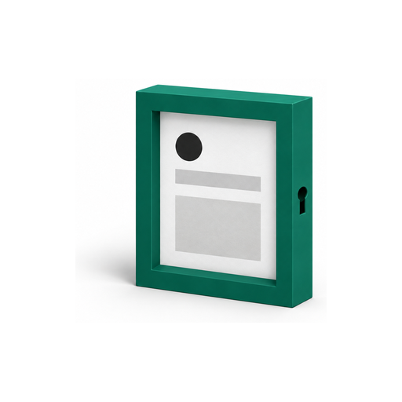

# Connect Looker Studio

Connect the report to the eight materialized tables in `pmax_reporting` using
the dedicated `pmax-looker` service account. The pack publishes a complete
validated window before readers see it. Looker calculates ratios from
additive measures at the chart's selected grain.

This guide uses the default dataset names. Substitute the deployed
`datasets.reporting` value wherever it differs. The
[data model](data-model.md) lists the dimensions and metric families; the
[cohort guide](cohorts.md) explains reading dates and unavailable cells.

## Prepare the reader identity

Every data-source editor must use a Google Workspace or Cloud Identity
identity from an organization listed in the deployment's
`looker_service_agents`. Phase 00's parent-organization check is a deployment
proxy; the operator still verifies each editor's organization. A personal
consumer account is not a supported editor identity.

Before the human-run phase 40:

1. List the people who will create or edit sources in `editors`, as `user:`
   principals. Report viewers do not need source-editing rights.
2. As a managed user of each editing organization, open Google's
   [service-account setup guide](https://docs.cloud.google.com/data-studio/set-up-a-google-cloud-service-account)
   and follow its service-agent help-page link. Copy the displayed agent into
   `looker_service_agents` as a `serviceAccount:` principal. Do this for the
   operator's organization now and the client's organization before hand-over.
   Do not construct an address from an organization number.
3. Set the reviewed `PMAX_LOOKER_PROBE_EXPIRES_AT` UTC time to cover both
   deployment passes. Reuse it on retries. An expired window requires the
   human-run IAM phase again.
4. Review the phase-40 plan and its grants below, then use the
   [deployment IAM procedure](../deploy/iam.md). Keep principal-bearing plan
   output private; do not commit it as evidence.

| Recipient | Grant and scope | Purpose |
|---|---|---|
| `pmax-looker` | `roles/bigquery.dataViewer`, reporting dataset access entry only | Read published data and metadata. |
| `pmax-looker` | `roles/bigquery.jobUser`, client project | Create query jobs billed to that project; it grants no dataset read access. |
| Each configured organizational service agent | `roles/iam.serviceAccountTokenCreator`, Looker account only | Let that organization's Looker service obtain reader credentials. |
| Each configured source editor | `roles/iam.serviceAccountUser`, Looker account only | Supply `iam.serviceAccounts.actAs` for source editing. |
| Named operator | Expiring `roles/iam.serviceAccountTokenCreator`, Looker account only | Run the deployment probes during the reviewed window. |

The pack grants Job User for every reader connection, including direct table
sources. Its queries bill to the client project. The dataset grant bounds
access to pack data; the project-wide per-user daily query quota in
[deploy/iam.md](../deploy/iam.md) bounds the reader's query usage only under
on-demand pricing, as described in Google's
[custom query quota guidance](https://docs.cloud.google.com/bigquery/docs/custom-quotas).
The same per-user limit applies to every user in the project, including
this reader. Google's
[BigQuery connector guide](https://docs.cloud.google.com/data-studio/connect-to-google-bigquery)
separates read permission from job creation and billing.

## Create and configure each data source

Complete the first successful publish before connecting the sources. Then:

1. In Looker Studio, create a reusable BigQuery data source. Choose the client
   project for billing and data, the configured reporting dataset, and one
   table from the recipe mappings below.
2. In **Data Credentials**, choose **Service Account Credentials** and enter
   the deployed `pmax-looker` account email. Enter the service account, not an
   organizational service agent. You do not need to download a key file.
3. Name the source with the client, reporting dataset, and table so it can be
   reused across reports. Record its project, table, date dimension, and
   freshness in the Go/No-Go record, `deployments/<project>/go-no-go-v2.1.0.md`
   for this release. Record the credential as a match against the deployed
   Looker account and the editor owner by role, never by address.
4. Check field types. `date`, `click_date`, and `as_of` are dates;
   `observed_through` is a timestamp. IDs and descriptive labels are dimensions.
   Additive measures use Sum. Keep the account's currency attached to financial
   charts; cohort tables have no currency column, so scope those charts to one
   account or an explicitly verified common currency.
5. Add the calculated fields below to the data source. Their explicit
   aggregation gives them **Auto** aggregation. Format CTR as percent, CPA as
   account currency, and ROAS as a number. Turn off field editing in reports
   once the shared source definitions are reviewed.
6. Add the source to the report and bind each chart's date range dimension to
   `date` for performance sources or `click_date` for cohort sources. Add a
   report-level date range control and make charts inherit it. Do not bind it
   to `as_of`, which identifies the reporting generation.
7. Set an explicit default range ending yesterday and within the configured
   reporting window. Verify that changing the control changes both a
   performance chart and a cohort chart. A longer selected date range cannot
   retrieve history that the reporting tables do not expose.

Google documents [service-account source editing](https://docs.cloud.google.com/data-studio/set-up-a-google-cloud-service-account),
[aggregated calculated fields](https://docs.cloud.google.com/data-studio/about-calculated-fields),
and [date range controls](https://docs.cloud.google.com/data-studio/date-range-control).

## Set freshness and show the publication date

Set **Data freshness** explicitly to **15 minutes** on every source as the
pack's starting configuration. This is a chosen setting, not the BigQuery
connector's platform default. Review it against actual query usage. Looker can
answer repeated queries from its cache until the configured threshold; a
changed filter can issue a new query earlier. Manual refresh can also issue
billable queries. [Google's freshness guide](https://docs.cloud.google.com/data-studio/manage-data-freshness)
explains the available intervals and cache behavior.

The ladder schedules a run at 04:00 in the deployment timezone
(`timezone_override`). Publication
happens after extraction, transformation, and validation finish, not exactly
at 04:00. Display the source's `as_of` as **Published as of** and
make the last included click date clear: it is `as_of - 1`. Keep `run_id`
available in a diagnostic table. The operations ledger supplies the actual
publish completion time if the operator needs a wall-clock timestamp.

One BigQuery query cannot read a half-published set of these tables because
publication [commits atomically](https://docs.cloud.google.com/bigquery/docs/transactions). Separate
chart queries can straddle the commit, and cached charts can lag behind newly
queried charts. Refresh the report after a confirmed successful publish and
check that every compared source shows the same `(as_of, run_id)` before
comparing them. A same-day repair can publish a new `run_id` with the same
`as_of`. A failed validation leaves the last successful reporting generation
in place; a successful Looker refresh alone does not prove a new generation
exists.

## Calculated fields per reporting table

The [v2.1.0 migration guide](migrations/v2.1.0.md#guard-schema-and-readers)
holds the upgrade mapping from the eight retired views.

Each recipe divides the sum of its numerator by the sum of its denominator.
The `CASE` guard returns NULL for a zero or missing denominator because it
has no ELSE branch, following Google's
[searched CASE semantics](https://docs.cloud.google.com/data-studio/case-searched).
Never average daily ratios: cost 10 and 90 with conversions 1 and 3 gives CPA
25, whereas averaging the two daily CPAs gives 20.

For the four performance sources, the recipes below use `metric_basis =
'NETWORK'`. Action rows populate the `action_*` measures and carry no allocated
cost, clicks, or impressions. They cannot supply action-specific performance
CPA. Campaign truth is the campaign-total source; adding asset attributions
does not reproduce it.

For cohort sources, filter to one counting convention, rung, and metric basis,
or keep them as chart dimensions; never aggregate across them. When filtering,
use the stated `cohort_counting` filter, one `cohort_day` or one window-rung
selection, and one `metric_basis`. A named-action chart also selects one
`conversion_action_resource_name` or keeps it as a dimension.
Cost repeats across rungs and conversion bases, so aggregating those together
overcounts spend. Retain `maturity`, `provenance`, and `observed_through` as
dimensions, or explicitly filter maturity to `complete`. A chart filtered to
`measured` deliberately excludes carried values and gaps; label that choice.
Publication excludes missing-cost cells; unavailable cohort cells with cost
remain visible with NULL conversions and value.

### `pmax_reporting.performance_campaign`

Date control: `date`. Grain: Campaign, network, and metric basis; retain `account_id` and currency when rolling up.
Filter: `metric_basis = 'NETWORK'`. `cohort_counting` does not apply.

| Field | Numerator | Denominator | Formula after aggregation |
|---|---|---|---|
| `ctr` | `network_clicks` | `network_impressions` | `CASE WHEN SUM(network_impressions) != 0 THEN SUM(network_clicks) / SUM(network_impressions) END` |
| `cpa` | `network_cost` | `network_conversions` | `CASE WHEN SUM(network_conversions) != 0 THEN SUM(network_cost) / SUM(network_conversions) END` |
| `roas` | `network_conversions_value` | `network_cost` | `CASE WHEN SUM(network_cost) != 0 THEN SUM(network_conversions_value) / SUM(network_cost) END` |

### `pmax_reporting.performance_asset_group`

Date control: `date`. Grain: Campaign plus asset group; do not combine this source with campaign totals as additive rows.
Filter: `metric_basis = 'NETWORK'`. `cohort_counting` does not apply.

| Field | Numerator | Denominator | Formula after aggregation |
|---|---|---|---|
| `ctr` | `network_clicks` | `network_impressions` | `CASE WHEN SUM(network_impressions) != 0 THEN SUM(network_clicks) / SUM(network_impressions) END` |
| `cpa` | `network_cost` | `network_conversions` | `CASE WHEN SUM(network_conversions) != 0 THEN SUM(network_cost) / SUM(network_conversions) END` |
| `roas` | `network_conversions_value` | `network_cost` | `CASE WHEN SUM(network_cost) != 0 THEN SUM(network_conversions_value) / SUM(network_cost) END` |

### `pmax_reporting.performance_asset`

Date control: `date`. Grain: Campaign, asset group, `asset_id`, and `field_type`; an asset used in several links remains several attributions.
Filter: `metric_basis = 'NETWORK'`. `cohort_counting` does not apply.

| Field | Numerator | Denominator | Formula after aggregation |
|---|---|---|---|
| `ctr` | `network_clicks` | `network_impressions` | `CASE WHEN SUM(network_impressions) != 0 THEN SUM(network_clicks) / SUM(network_impressions) END` |
| `cpa` | `network_cost` | `network_conversions` | `CASE WHEN SUM(network_conversions) != 0 THEN SUM(network_cost) / SUM(network_conversions) END` |
| `roas` | `network_conversions_value` | `network_cost` | `CASE WHEN SUM(network_cost) != 0 THEN SUM(network_conversions_value) / SUM(network_cost) END` |

### `pmax_reporting.asset_performance`

Date control: `date`. Grain: Asset-link performance with descriptive asset dimensions, including `asset_primary_status_reasons_text`; do not add it to `performance_asset`.
Filter: `metric_basis = 'NETWORK'`. `cohort_counting` does not apply.

| Field | Numerator | Denominator | Formula after aggregation |
|---|---|---|---|
| `ctr` | `network_clicks` | `network_impressions` | `CASE WHEN SUM(network_impressions) != 0 THEN SUM(network_clicks) / SUM(network_impressions) END` |
| `cpa` | `network_cost` | `network_conversions` | `CASE WHEN SUM(network_conversions) != 0 THEN SUM(network_cost) / SUM(network_conversions) END` |
| `roas` | `network_conversions_value` | `network_cost` | `CASE WHEN SUM(network_cost) != 0 THEN SUM(network_conversions_value) / SUM(network_cost) END` |

### `pmax_reporting.campaign_truth`

Date control: `date`. Grain: Campaign and network; use this source for account or campaign totals rather than summing asset sources.
`cohort_counting` and `metric_basis` do not apply to this source.

| Field | Numerator | Denominator | Formula after aggregation |
|---|---|---|---|
| `ctr` | `clicks` | `impressions` | `CASE WHEN SUM(impressions) != 0 THEN SUM(clicks) / SUM(impressions) END` |
| `cpa` | `cost` | `conversions` | `CASE WHEN SUM(conversions) != 0 THEN SUM(cost) / SUM(conversions) END` |
| `roas` | `conversions_value` | `cost` | `CASE WHEN SUM(cost) != 0 THEN SUM(conversions_value) / SUM(cost) END` |

### `pmax_reporting.cohort_campaign`

Date control: `click_date`. Grain: Campaign, network, basis, action, rung, and evidence dimensions. Filter to one counting convention, rung, and metric basis, or keep them as chart dimensions; never aggregate across them.
Counting filter: `cohort_counting = 'google_lag'`; apply the cohort filters
above. Legacy NULL counting rows require a separate historical comparison.

| Field | Numerator | Denominator | Formula after aggregation |
|---|---|---|---|
| `cohort_cpa` | `click_day_cost` | `cohorted_conversions` | `CASE WHEN SUM(cohorted_conversions) != 0 THEN SUM(click_day_cost) / SUM(cohorted_conversions) END` |
| `cohort_roas` | `cohorted_value` | `click_day_cost` | `CASE WHEN SUM(click_day_cost) != 0 THEN SUM(cohorted_value) / SUM(click_day_cost) END` |

### `pmax_reporting.cohort_asset_group`

Date control: `click_date`. Grain: Campaign plus asset group, network, basis, action, rung, and evidence dimensions; the mart uses lag-bucket values.
Counting filter: `cohort_counting = 'google_lag'`; apply the cohort filters
above. Legacy NULL counting rows require a separate historical comparison.

| Field | Numerator | Denominator | Formula after aggregation |
|---|---|---|---|
| `cohort_cpa` | `click_day_cost` | `cohorted_conversions` | `CASE WHEN SUM(cohorted_conversions) != 0 THEN SUM(click_day_cost) / SUM(cohorted_conversions) END` |
| `cohort_roas` | `cohorted_value` | `click_day_cost` | `CASE WHEN SUM(click_day_cost) != 0 THEN SUM(cohorted_value) / SUM(click_day_cost) END` |

### `pmax_reporting.cohort_asset`

Date control: `click_date`. Grain: Campaign, asset group, `asset_id`, `field_type`, network, basis, action, rung, and evidence dimensions; keep link-level attribution distinct.
Counting filter: `cohort_counting = 'arp_calendar'`; apply the cohort filters
above. Legacy NULL counting rows require a separate historical comparison.

| Field | Numerator | Denominator | Formula after aggregation |
|---|---|---|---|
| `cohort_cpa` | `click_day_cost` | `cohorted_conversions` | `CASE WHEN SUM(cohorted_conversions) != 0 THEN SUM(click_day_cost) / SUM(cohorted_conversions) END` |
| `cohort_roas` | `cohorted_value` | `click_day_cost` | `CASE WHEN SUM(click_day_cost) != 0 THEN SUM(cohorted_value) / SUM(click_day_cost) END` |

## Verify the connection before sharing

Use the permission-specific probe sequence in [deploy/iam.md](../deploy/iam.md).
The pass-1 pre-check runs as the last step of phase 75; a refusal stops that
phase. Phase 88 records the full set against the published reader account:

| Probe | Evidence required |
|---|---|
| One-row reporting-table read | `tables.getData` succeeds as the reader; zero rows is permitted if the resolved table is empty. |
| Dataset visibility | Dataset listing returns exactly the configured reporting dataset. |
| Other dataset metadata and direct reads | Every dataset exported by phase 00 other than reporting rejects both describe and one-row read with access denial. |
| Query-shaped denials | Table creation in reporting and a SELECT in each other dataset fail on the permission exercised, not on inability to create query jobs. |
| Audit corroboration | A matching PERMISSION_DENIED Data Access entry for each direct read and dataset-describe denial, with the recorded principal, resource, method, and probe window. |
| Looker-side read | Refresh a real chart and record the successful reporting table-read audit entry as a `pmax-looker` principal match with its role, timestamp, and insert ID, never the address. |

The first five checks prove the configured IAM surface. The last one proves
the organizational service-agent path used by Looker itself. Record that
principal in the Go/No-Go as a match with its role, timestamp, and insert ID,
never its address. If a refresh is served from Looker or BigQuery
cache, it may not produce a new table-read event. Issue a fresh chart query
that reads the table and allow log propagation; missing audit evidence stays
pending. Google's [audit-log coverage](https://docs.cloud.google.com/bigquery/docs/reference/auditlogs)
explains the cached-query exception. Test the report with a named viewer who
lacks BigQuery grants. Compare one chart's additive totals and zero-denominator
behavior with the reporting table before handing it over.

## Share, hand over, and revoke

Share reports with named users or the client's domain, never link sharing.
Viewers consume data through the reader account; report sharing therefore
controls who can see those results. Share source
editing only after the new editor's organizational agent and `actAs` grant
are in place.

Editing a service-account data source without `actAs` switches it to the editor's personal credentials.
See [Google's source-editing behavior](https://docs.cloud.google.com/data-studio/set-up-a-google-cloud-service-account#edit_a_data_source_that_uses_service_account_credentials).
After any ownership or editor change,
recheck **Data Credentials**, refresh a chart, and verify the audit principal.
Personal credentials are not a fallback mode for this product. The
[credential-flip detector](operations.md#credential-flip-detector) checks successful reporting reads
in the Go/No-Go after-invariants, every Monday after the scheduled run, and after editor or data-source changes;
Looker-labelled query jobs are supplementary evidence, not a replacement for
the table-read principal.

At hand-over, add the client's organizational service agent to
`looker_service_agents` and the managed editors to `editors` in the deployment
config, then apply the grants through a ladder run's human-run phase 40 using
the [Looker IAM procedure](../deploy/iam.md#looker-service-account-credentials-and-probe-window).
Verify a client-edited source still reads as `pmax-looker` and remove obsolete
operator probe bindings. At revocation, follow
[Reader-account offboarding](operations.md#reader-account-offboarding):
inspect the last seven days of reader activity and notify or
repoint consumers, disable the reader, prove token minting and chart refresh
fail, remove the reporting access entry and every agent/editor binding, and
delete the reader after the 30-day hold. Remove revoked editors from report
sharing separately. A removed IAM binding does not remove report sharing, and
removing report sharing does not remove IAM.

## Diagnose a wrong or unavailable chart

| Symptom | First checks |
|---|---|
| An older generation after a successful pipeline run | Check the publish stage, each source's `(as_of, run_id)`, then freshness and manual refresh. |
| New editor cannot keep service-account credentials | Check managed organization, configured service agent, and `actAs` before editing again. |
| Permission error on a source | Confirm the source uses the reporting dataset and client billing project; inspect the reader grants and probe evidence. |
| CPA differs after a date or dimension change | Confirm sum-over-sum, one currency, one basis, and no duplicated blend keys. |
| Cohort spend grows when more rungs are shown | Remove the cross-rung total; cost repeats per rung and basis. |
| Empty or NULL asset final rung | Read `unavailable_reason` and reporting-window cap in the cohort guide. A cache refresh cannot supply an uncollected reading. |

The pack ships reporting tables and documented recipes. It does not include a
ready-made Looker template. Any report or blend built on them still needs its own grain and
sharing review.
