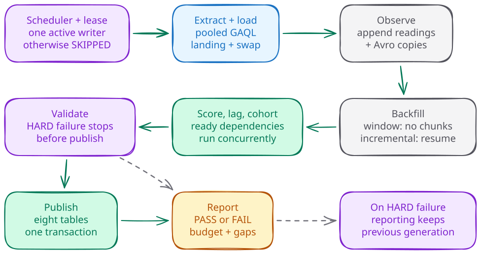

# Operations


The operator's daily job is to confirm that the published reporting date
advanced, investigate failures, and preserve the next observation. The pack
runs as one private, digest-pinned Cloud Run Job in the configured `REGION`
(see [invocation convention](migrations/v2.1.0.md#invocation-convention)). A paused-first
Cloud Scheduler trigger starts the daily run in the configured deployment
timezone (`timezone_override`). Configuration comes from a private GCS YAML
object; the existing Google Ads credential comes from one pinned Secret
Manager version mounted as a file.

Use the [migration guide](migrations/v2.1.0.md) for the ordered upgrade and
rollback procedure, [storage guide](storage.md) for retention choices, and
[Looker Studio guide](looker.md) for report setup. The private `RUNBOOK.md`
contains deployment-specific evidence and is
excluded from the public export.



## Daily execution and failure handling

`run` executes extract, load, observe, backfill, score, lag, cohort, validate,
publish and report in that order. The default reporting window is 90 days.
The daily pull includes the partial run day; reporting publishes complete
click days from `as_of - reporting_window_days` through `as_of - 1`. Reporting
DDL runs before one transaction replaces all eight reporting tables. A HARD
validation failure stops before publish, leaving the previous reporting
generation available. Marts can therefore be newer than the reporting tables.

Reports live at `reports/<deployment>/<run_id>.md`, with a `latest.md` pointer.
An executed daily `run` advances that pointer on PASS or FAIL; SKIPPED,
rebuild and backfill reports do not. Use the run ID, status, mode,
image digest, window and per-stage results in the report to diagnose a failure;
a recent file timestamp alone does not prove a successful publish. Check the
row-level `as_of` in reporting when a chart appears stale, then check its
configured cache freshness.

The report and the run ledger use different status words. The report headline
is PASS, or FAIL when a HARD assertion failed. The ledger records the execution
as SUCCESS or FAILED; a FAIL report and any stage error both record FAILED. An
execution that finds the lease held is SKIPPED in both.

After a FAIL report or a FAILED ledger status:

1. Read the execution logs and run-id report. Identify the first failed stage
   and whether observe completed successfully.
2. Check the lease and execution state before starting another run. A timeout
   while waiting for a job is not proof that it stopped.
3. Fix the cause and rerun `run` to take a new observation. A rebuild only
   derives tables from existing data; it cannot replace a missing observation.
4. Confirm that the rerun's report is PASS and its ledger status is SUCCESS,
   then confirm publication and the expected observation date. Preserve both
   reports when the rerun is an incident repair.

Complete the observe stage before midnight in the deployment timezone. Deployments require `timezone_override`; the observe stage uses
that timezone. The per-account snapshot fallback is available only to CLI
runs outside the deploy ladder whose config omits the override. An observe
stage can succeed even if a later stage fails. Its rows stay in the append-only
log, and the pack selects the lexically greatest run ID among successful
observe stages for that account and observed date. A later successful same-day
observe therefore replaces the selected reading without deleting the earlier
rows.
Tomorrow's run has a different `observed_date` and cannot recreate today's
missed reading. Cohort carry rules may bridge a gap for at most five calendar days, but they
do not turn it into a measurement.

The maximum unattended window is five days, matching that carry budget, so
pause Scheduler before the next run once five days pass without an operator
review, then review failures, the latest report, lease state, and data
freshness.

Every execution mints a time-sortable, label-safe run ID. `PMAX_RUN_ID` adds
only a normalized correlation suffix after the generated ordering prefix; the
suffix is truncated to keep the complete ID within 63 characters. Use it to
correlate repairs without changing which same-day reading wins.

While Scheduler is paused for an upgrade, the deployment operator runs one
manual `run` every scheduled morning through phase-95 resume. Check that the
image, schema and config are compatible first, and do not overlap that run
with the ladder. In `deployments/<project>/paused-mornings-v2.1.0.md`, record
UTC execution times and the date in the deployment timezone. The migration guide describes
the saved-config fallback if the upgrade cannot finish before the next morning.

### Paused-morning execution

Use the migration guide's [invocation convention](migrations/v2.1.0.md#invocation-convention)
for `REGION`, credentials, `EVIDENCE` and the private scratch directory.
On every paused scheduled morning from
step 0 through phase-95 resume, check PAUSED and no live lease/incomplete
execution.

Before the manual execution, use the configured `REPORT_BUCKET` and run
these readbacks as the operator. Raw outputs stay in `EVIDENCE_SCRATCH`:

```bash
gcloud scheduler jobs describe pmax-pack-daily --project="$PROJECT" \
  --location="$REGION" --format='value(state)' --quiet
gcloud run jobs executions list --job=pmax-pack-daily --project="$PROJECT" \
  --region="$REGION" --format=json --quiet \
  > "$EVIDENCE_SCRATCH/executions.json" 2> "$EVIDENCE_SCRATCH/idle.err"
if gcloud storage objects describe "gs://$REPORT_BUCKET/lease.json" \
  --project="$PROJECT" --format=json --quiet \
  > "$EVIDENCE_SCRATCH/lease-metadata.json" 2> "$EVIDENCE_SCRATCH/lease-read.err"; then
  LEASE_PRESENT=1
elif grep -Eq '(^|[^0-9])404([^0-9]|$)|NotFoundException' "$EVIDENCE_SCRATCH/lease-read.err"; then
  LEASE_PRESENT=0
  echo 'lease absent'
else
  echo 'NO-GO: cannot prove lease absent'
  exit 1
fi
```

Require Scheduler's result to be `PAUSED`. For every returned execution,
require a nonempty `status.completionTime`; an empty list is acceptable, an
unreadable list is not. Inspect the lease describe exit status immediately:
only a confirmed `404`/`NotFoundException` proves absence. A permission,
network or other error is NO-GO. If the object exists, read its body:

```bash
if [[ "$LEASE_PRESENT" == 1 ]]; then
gcloud storage cat "gs://$REPORT_BUCKET/lease.json" --project="$PROJECT" --quiet \
  > "$EVIDENCE_SCRATCH/lease.json" 2> "$EVIDENCE_SCRATCH/lease-read.err"
uv run python - "$EVIDENCE_SCRATCH/lease.json" <<'PY_LEASE_READ'
from datetime import datetime, timezone
import json
from pathlib import Path
import sys
try:
    value = json.loads(Path(sys.argv[1]).read_text())
    expires = datetime.fromisoformat(value['expires_at'].replace('Z', '+00:00'))
    if expires.tzinfo is None:
        raise ValueError('missing timezone')
except (ValueError, KeyError, TypeError, AttributeError):
    raise SystemExit('NO-GO: cannot prove lease expired') from None
if expires > datetime.now(timezone.utc):
    raise SystemExit('NO-GO: live lease; wait for its holder')
print('lease expired')
PY_LEASE_READ
fi
```

An expired lease alone does not prove a Cloud Run execution stopped; all three
checks must pass. Record the UTC check time, Scheduler state, incomplete
execution count, and lease absent/expired result, then remove the raw files.
Wait outside the ladder for a live holder; never delete or overwrite the lease
to make the checks pass. This follows `assert_ladder_idle` in `deploy/deploy.sh`.
Only after these checks, execute the manual run:

```bash
gcloud run jobs execute pmax-pack-daily --project="$PROJECT" --region="$REGION" \
  --args=run --async --format='value(metadata.name)' --quiet
gcloud run jobs executions describe "$EXECUTION_NAME" --project="$PROJECT" \
  --region="$REGION" --format=json --quiet \
  > "$EVIDENCE_SCRATCH/execution.json" 2> "$EVIDENCE_SCRATCH/execution.err"
jq '{execution: .metadata.name, start: .status.startTime, end: .status.completionTime, conditions: [.status.conditions[] | {type, status}]}' \
  "$EVIDENCE_SCRATCH/execution.json" > "$EVIDENCE/manual-execution-summary.json"
rm -f "$EVIDENCE_SCRATCH/execution.json" "$EVIDENCE_SCRATCH/execution.err"
```

Set `EXECUTION_NAME` to the returned value, retain it before polling, and give each final summary an execution-specific
filename in the morning record so later polls do not erase its evidence.
Require successful completion, a SUCCESS ledger row, report URI and the day's
observation. An API timeout is not permission to launch another execution.
Record in `deployments/<project>/paused-mornings-v2.1.0.md`:

| Scheduled date/time (deployment timezone) | UTC start/end | Execution / run ID | Image digest / config generation | Status / report URI | Observation triple before/after | Operator / explanation |
|---|---|---|---|---|---|---|
| | | | | | | |

This evidence continues during any multi-day signature delay. Handle a missed
observation with the [failure-handling steps](#daily-execution-and-failure-handling).
Stop ladder work around the scheduled morning so the manual run can finish
without overlapping schema or retention changes.

## History checkpoints

Window storage has no historical chunks to drain. Incremental storage plans
monthly chunks from the configured `start_date`, clamped to the 37-month
extraction wall. That wall is the Google Ads API's 37-month lookback for
daily, hourly and weekly report segments
([system limits](https://developers.google.com/google-ads/api/docs/best-practices/system-limits)),
fixed in the pack as `GRANULAR_MONTHS`. An explicit incremental start must be month-aligned. When
omitted, it is the first day of the month containing
the run date minus `reporting_window_days`; window mode ignores `start_date`
with a warning if supplied.

The checkpoint hash contains only the family A, B and C query texts plus the
Google Ads API version. The [query-family definitions](data-model.md#query-families)
identify those extraction queries. Neither an explicit `start_date` nor the omitted-start
default enters the hash. Changing the requested start or advancing the calendar
changes the chunk plan without invalidating completed chunks under the same
query contract. Family D remains the daily entity snapshot.

The hash changes once at this upgrade, so the pack re-extracts existing
incremental history once under the new hash. After that, checkpoints stay
reusable while the family A/B/C query texts and API version stay unchanged.
Budget that drain before upgrading. Phase 70 starts one supervised incremental
`run` as the plan probe; its `pending_after` is authoritative. A zero ends the
loop after that one execution, which still counts against
`PMAX_FIRST_RUN_MAX_EXECUTIONS`.
After the drain, phase 70 rebuilds history with `--window-start` at the clamped
start. Every repeated phase-70 invocation includes the full applicable sequence.

For a reviewed historical repair after checkpoint reset, invoke backfill from
the product root with the normal config and credential inputs:

```bash
PMAX_CONFIG="$CONFIG_LOCAL" \
GOOGLE_ADS_CONFIGURATION_FILE_PATH="$CREDENTIAL_FILE" \
uv run pmax-pack backfill --account "$ACCOUNT"
```

`ACCOUNT` is a configured 10-digit customer ID. It selects that account's
pending chunk plan; every resolved account is still extracted, union-written
and checkpointed. Backfill acquires the shared `run` lease mode, so it cannot
overlap another holder of the pipeline lease. A held lease produces SKIPPED,
not a completed repair. Inspect the backfill stage's `pending_before` and
`pending_after` in its run report, supervise further invocations until the
approved chunks are complete, then rebuild with the reviewed `--window-start`.
The standalone backfill mode does not take a new daily observation; keep the
[paused-morning duty](#paused-morning-execution) when Scheduler is paused.

## Rebuild and publish controls

A rebuild runs score, lag, cohort, validate, publish and report. It neither
extracts nor observes. `--target-dataset` must be the configured live marts or
marts verify dataset; selecting the verify target also redirects publication
to reporting verify. Lease scope includes both destination datasets.

```bash
uv run pmax-pack rebuild \
  --as-of YYYY-MM-DD \
  --target-dataset pmax_marts_verify \
  --dry-run
```

Substitute the configured dataset name and a real ISO date. Review the dry run
before a real rebuild. `--window-start=YYYY-MM-DD` widens the derived history,
clamped to the wall, and refuses a date after `--as-of`. It does not
widen the published reporting window.

For a real production rebuild, the older-as-of check runs once after lease
acquisition and before the score stage or any mart rewrite; a verification
rebuild takes no lease and runs the check first, also before the score stage or
any mart rewrite.
The publish stage records that decision without repeating the check; the
production lease excludes a concurrent publish.

A real rebuild refuses to replace a newer reporting generation unless
`--allow-older-as-of` is supplied. Use that override only for an intentional
reporting-date rollback and record the resulting date for readers. A failed
guard read also stops publication. In a dry run the older-as-of publish guard
is recorded as `not evaluated (dry run)`, so an older-date refusal appears only
on a real run.

`rebuild --dry-run` skips the billed family-D
[observation bound](cohorts.md#how-much-observation-history-is-collected)
derivation and report collectors. The transform window still comes from
`reporting_window_days` or the explicit rebuild override. Its observation
estimate is `min(reporting_window_days, max(cohort_days) + 1 +
restatement_margin_days)`, with source `config_fallback`. It records
`dry-run: report collectors skipped`, reports the estimate, and publishes
nothing. This is not evidence of live assertion results or fresh reporting.

## Runtime budget and query cost

The report's budget block measures startup from CLI process entry, stage span,
tail, and process total through the final report snapshot. Final upload is
excluded. Scheduler-trigger-to-process-entry time is outside these measurements;
keep the Cloud Run execution timestamps beside the report when assessing
end-to-end elapsed time. SKIPPED reports omit the budget block.

The stage-span target is 120 seconds and is informational. Expect the first
post-ship reading to land above the target. Record the first two scheduled
reports as the baseline, including per-stage jobs, load-path jobs, rows loaded
and report size. Investigate a change from that measured baseline before
changing pool size or retention. Cost also depends on scanned bytes, stored
history, report query frequency and cache freshness, so read spend from
billing data, not from elapsed time.

`Total jobs: N (submissions)` counts client submissions. A multi-statement
script is one submission. Reconcile real nightly runs only, using the exact
run ID and execution bounds:

```sql
SELECT
  job_type,
  COUNT(*) AS submissions,
  SUM(total_bytes_processed) AS bytes_processed,
  SUM(total_slot_ms) AS slot_ms
FROM `PROJECT.region-eu.INFORMATION_SCHEMA.JOBS_BY_PROJECT`
WHERE creation_time >= @execution_start
  AND creation_time <= @execution_end
  AND parent_job_id IS NULL
  AND EXISTS (
    SELECT 1 FROM UNNEST(labels) AS label
    WHERE label.key = 'run_id' AND label.value = @run_id
  )
GROUP BY job_type
ORDER BY job_type;
```

Run it through the migration guide's
[capped, audit-labelled operator query runner](migrations/v2.1.0.md#evidence-query-recipes). Excluding child jobs makes the submission count comparable and avoids
counting a script and its statements twice. Explain missing or late metadata
before accepting the reconciliation. A rebuild dry run publishes nothing and
is outside this recipe, regardless of whether its jobs appear in the view.
The [JOBS schema](https://docs.cloud.google.com/bigquery/docs/information-schema-jobs)
defines the parent relationship and region scope.

## Identities, credentials and data protection

The pack extracts aggregate advertising performance and entity configuration,
including account and advertising-entity IDs; it does not extract end-user
identifiers. The permitted data principals are the runtime service account,
the named operator, and the dedicated Looker service account on reporting
only. Report viewers receive access through the report's sharing settings.
Share reports with named users or the client's domain, never link sharing. The
[IAM contract](../deploy/iam.md) lists the exact grants and negative probes.

Runtime can write raw, marts, ops and both verification/reporting pairs. The
Looker account receives reporting dataViewer plus project jobUser; the latter
permits job creation without granting access to other datasets. Looker queries
bill to the client project and are bounded by dataset access and the configured
project-wide per-user daily query quota. The per-user daily query quota bounds
Looker queries only under on-demand pricing. See the
[custom-quota scope](https://docs.cloud.google.com/bigquery/docs/custom-quotas). Each editor must be a managed user
of a listed organization, with `actAs` granted before editing a data source.
Editing a service-account data source without `actAs` switches it to the editor's personal credentials.
See [Google's source-editing behavior](https://docs.cloud.google.com/data-studio/set-up-a-google-cloud-service-account#edit_a_data_source_that_uses_service_account_credentials).
Personal credentials are not a fallback mode for this product. After an edit,
recheck Data Credentials, refresh a chart and verify the reader principal with
the [credential-flip detector](#credential-flip-detector).
The [Looker guide](looker.md) covers setup and verification.

The secret holds the shared manager-account (MCC) token from the operator's
existing Google Ads credential file and own Google login. Its top-manager `login_customer_id`
provides access, while the deployed config's exact account list bounds
extraction. The operator keeps a private shared-token consumer inventory. Each
row records one consumer of that token, its storage location, the last
verified UTC date, and the results of a one-row probe and a natural scheduled
run. The pack's row names its pinned Secret Manager version. To
rotate, run a ladder pass with the replacement file as
`--credential-file`; phase 30 probes it and adds a Secret Manager version when
the payload changed, and the pass pins the Job to that numeric version.
Verify the pack and every other inventory consumer, then retire the old copies:
disable the previous Secret Manager version once the Job is pinned to the new
number, and delete the old file from every other consumer. Do not call
Google's
[OAuth 2.0 revoke endpoint](https://developers.google.com/identity/protocols/oauth2/web-server#tokenrevoke)
and do not remove the app on the Google Account permissions page during a
routine rotation: either one revokes the whole grant, which invalidates every
token the same login granted to the project, including the replacement. A
routine rotation therefore replaces copies and leaves the old token valid.
When the old token itself must stop working, take the compromise path: revoke
first, accept the downtime, grant a replacement, then redistribute it to every
consumer, because a leaked pack secret exposes the whole MCC.

Data Access audit logs identify the principal for successful reads and remain
available for the log bucket's configured retention period, normally 30 days
for the default bucket. Record the actual coverage using the
[retention readback](#log-retention-readback). Automatic partition
expiry produces no `TableDataChange` entry in this per-principal trail; inspect
partition metadata to prove retention. Whole-table expiry has a separate system
event. See [BigQuery audit-log limits](https://docs.cloud.google.com/bigquery/docs/reference/auditlogs#data_access_data_access)
and [table-expiry events](https://docs.cloud.google.com/bigquery/docs/reference/auditlogs#system_event_system_event)
and [log retention](https://docs.cloud.google.com/logging/quotas#logs_retention_periods).
Observation Avro copies under `observations/<account>/<observed_date>/` are
outside the report bucket's lifecycle. Looker caches persist until the
configured freshness interval; they require separate incident handling.

### Log-retention readback

In the project's Logs Router, identify the bucket receiving the Data Access
sink used by the detector. Set `LOG_BUCKET` and `LOG_BUCKET_LOCATION` to that
bucket's ID and location, and use its owning project as `LOG_BUCKET_PROJECT`.
The log location is independent of Cloud Run's `REGION`:

```bash
gcloud logging buckets describe "$LOG_BUCKET" --project="$LOG_BUCKET_PROJECT" \
  --location="$LOG_BUCKET_LOCATION" --format='value(retentionDays)' --quiet
```

Record the returned days, bucket role, UTC readback time and the earliest
available timestamp in the detector's actual results. A configured retention
period does not prove uninterrupted logging or sink delivery; record any gap
separately and require the detector's positive control before certifying zero
unexplained reads. See [log-bucket readback](https://docs.cloud.google.com/sdk/gcloud/reference/logging/buckets/describe).

### Reader-account offboarding

Perform these steps in order as the operator, before account deletion or
[project teardown](#project-teardown):

1. Read the Looker account's last seven days of successful reads using the
   [credential-flip detector](#credential-flip-detector) query. Summarize affected reports without
   principal addresses and record the actual covered interval.
2. Notify or repoint affected report owners before disabling the account.
3. Disable the dedicated Looker service account, then record its `disabled`
   state with this describe call. In Google Cloud console, select `PROJECT`,
   open IAM & Admin > Service Accounts, select the configured Looker account,
   and under Service account status choose Disable service account, then
   confirm Disable. A false or absent disabled value is a stop:

   ```bash
   gcloud iam service-accounts describe "$LOOKER_SA" --project="$PROJECT" \
     --format='value(disabled)' --quiet
   ```

4. Prove a new token mint and a chart refresh fail. After the disabled-state
   readback, run this mint probe as the operator while the reviewed Token
   Creator window still covers the check. It uses the phase-88 mint route
   with the Looker account as the impersonation target; token output is
   discarded even on an unexpected success:

   ```bash
   if gcloud auth print-access-token \
     --impersonate-service-account="$LOOKER_SA" --lifetime=300 --quiet \
     > /dev/null 2> "$EVIDENCE_SCRATCH/disabled-mint.err"; then
     echo 'Unexpected mint success: stop offboarding proof'
     exit 1
   fi
   ```

   Open an affected Looker report after its freshness interval, refresh its
   data, and require the source read to fail. The token-mint failure must
   name the disabled account in the private scratch result; a failure caused
   only by the operator's expired Token Creator grant is not proof. Compare the
   named account in scratch and record only `disabled account match` or
   `disabled account mismatch`, then delete that raw output. Wait beyond the
   configured chart freshness/cache interval and already-issued token lifetime
   before claiming revocation is observed. Preserve timestamps and denial
   reasons without addresses.
5. Remove the reporting dataset access entry and bindings: every listed
   service-agent Token Creator binding, every operator probe binding including
   stale conditions, and every editor Service Account User binding. Inventory
   the live policy in scratch, not only the possibly stale config, and save
   count/role summaries. Remove each departing editor from report sharing too;
   IAM removal and report sharing are separate operations. In BigQuery Studio,
   select the reporting dataset, open Sharing > Permissions, expand the Looker
   principal, choose Remove principal, then confirm Remove. On the Looker
   service account's Permissions tab, under Principals with access to this
   service account, edit each listed service-agent, operator and editor row;
   delete the relevant role and save. Include Google-provided role grants to
   see service agents. Remove each obsolete conditional operator binding using
   its exact expiry/title with the [IAM removal recipe](../deploy/iam.md#human-run-hand-over-and-revocation).
   Resolve inherited grants at the resource where they were granted. In the
   report's Share dialog, remove departing editors from the access list.
   Read both policies back and retain only counts/roles and a config match.
6. Keep the disabled account for a 30-day hold, then delete it with explicit
   operator approval. In Google Cloud console > IAM & Admin > Service
   Accounts, select `PROJECT`, select the disabled Looker account and choose
   Delete; confirm the target before submitting. Preserve the hold start, intended deletion date and
   serving-denial evidence outside the project before
   [project teardown](#project-teardown).

The account's recorded disabled state and the disabled-account mint refusal
are both required, so an expired probe grant cannot masquerade as revocation.
See [disable service accounts](https://docs.cloud.google.com/iam/docs/service-accounts-disable-enable),
[mint short-lived credentials](https://docs.cloud.google.com/iam/docs/create-short-lived-credentials-direct),
[dataset permissions](https://docs.cloud.google.com/bigquery/docs/control-access-to-resources-iam),
[service-account permissions](https://docs.cloud.google.com/iam/docs/manage-access-service-accounts),
and [delete service accounts](https://docs.cloud.google.com/iam/docs/service-accounts-delete-undelete).

### Project teardown

Teardown is destructive and requires separate operator approval. Perform these
steps in order:

1. Pause Scheduler.
2. Complete the [reader-account offboarding](#reader-account-offboarding).
3. Remove every Job invoker.
4. Remove the pack from the shared-token consumer inventory.
5. Destroy the pack's Secret Manager versions without revoking the shared
   token, which other consumers still use.
6. Remove the Workload Identity Federation provider and pool with the
   [pool and provider procedure](../deploy/iam.md#remove-the-unused-wif-pool),
   then remove the pack's IAM bindings and service accounts.
7. Apply the approved retention or deletion policy to data, reports, and
   observation backups.
8. Prove denied probes for Scheduler, runtime, CI, the deployer, and former
   downstream readers.

Preserve the signed teardown record outside the deleted project.

### Reader access proof

Phase 75 ends with an unrecorded positive pre-check. The operator resolves a
base table in reporting, then the Looker identity reads at most one row.
Phase 88 repeats it and records the complete permission matrix:

| Probe | Required result |
|---|---|
| Reporting direct table read (`tables.getData`) | Successful response containing zero or one row; evidence retains the count and resolved table, never row contents |
| Dataset listing | Exactly the configured reporting dataset is visible |
| Every other configured dataset: describe and direct table read | Both return resource PERMISSION_DENIED, with a separate audit-log slot for each denial |
| Every other configured dataset: capped SELECT | Data access denied; failure to create a query job is insufficient |
| Reporting: capped CREATE TABLE | Table creation denied; unexpected success stops the phase for operator cleanup |

The operator resolves a table in each denied dataset. When none exists, the
record carries the synthetic name `pmax_probe_missing`, never created and never
read, and marks the table read and capped SELECT `NOT_PROVABLE_EMPTY_DATASET`;
the dataset describe denial is the proof for an empty dataset, because BigQuery
reports a missing table as Not Found to every caller. The record identifies
which route was used. Not Found, a token error, transport failure or quota
rejection does not prove a resource-access denial. The direct read
and describe routes exercise different permissions from query-job creation.

Before signing off, run the audit command saved in the phase-88 probe record,
match principal, resource, method and UTC interval, and fill every denied
read/describe slot. A successful probe run alone is not corroboration. The
first successful Looker-side chart read separately proves the organization
service-agent route. Follow the [IAM probe contract](../deploy/iam.md#mandatory-negative-probes)
for evidence fields and temporary grant renewal.

## Credential-flip detector

Run the credential-flip detector in the Go/No-Go after-invariants, every Monday
after the scheduled run, and after editor or data-source changes. The named
deployment operator owns the check. Save the UTC interval, query, result count,
reviewed exceptions and operator role at
`deployments/<project>/looker-flip-detector-YYYY-MM-DD.md`.

Verify BigQuery `DATA_READ` audit logging is enabled for the project with no
`exemptedMembers`. Verify the log sink delivers these reads to the bucket
queried. Require at least one positive matched Looker or runtime read in the
interval. Zero unexplained readers without that positive control is
inconclusive, not a pass.

Read the project IAM policy into private scratch before each check:

```bash
gcloud projects get-iam-policy "$PROJECT" --project="$PROJECT" --format=json --quiet \
  > "$EVIDENCE_SCRATCH/project-policy.json" 2> "$EVIDENCE_SCRATCH/readback.err"
```

Inspect `auditConfigs` for `bigquery.googleapis.com` (and any `allServices`
configuration): require `DATA_READ` and no reader exemptions. Phase 40 adds
missing log types but preserves existing exemptions. In the project's Logs
Router, inspect the sink that routes Data Access logs: it must be enabled,
include successful reporting reads, have no matching exclusion, and target
the bucket selected for this query. In Logs Explorer select that bucket and
verify a matched read in the exact interval; record its timestamp and insert
ID beside the sink/bucket match result. Inspect inherited routing or audit
settings too when present. If delivery or visibility cannot be demonstrated,
stop the check as inconclusive. Record only counts, roles and match results,
then remove the raw policy and error file. See Google's
[audit configuration](https://docs.cloud.google.com/logging/docs/audit/configure-data-access)
and [log routing](https://docs.cloud.google.com/logging/docs/routing/overview).

The CLI recipe below reads the `PROJECT` scope; it does not select a bucket or
view. The positive control must appear in that detector output with the same
timestamp and insert ID as the sink/bucket check. A positive visible only in
another Logs Explorer view does not qualify. If the required logs are routed
outside this readable scope, this recipe is inconclusive until the operator
reviews a query scoped to their actual destination. See the
[logging-read resource scope](https://docs.cloud.google.com/sdk/gcloud/reference/logging/read).

1. Read successful reporting-table reads from the data project's Data Access
   log, covering at least the last seven days and overlapping the previous
   successful check. Do not cap the result count; a cap can drop reads.
2. Match each principal against the configured Looker account and runtime.
   Resolve other reads through their exact job reference in the billing
   project's JOBS view. Audit labels exempt only the recorded operator or
   runtime principal with both `app=pmax` and `stage=audit`; labels on another
   principal never authorize it.
3. Require zero unexplained readers. A missing job, inaccessible billing
   project or unknown principal remains unexplained. Investigate positive
   results and restore the approved source credential before closing them.
4. Use `requestor:looker_studio` job labels as supplementary evidence. A
   flipped source can bill another project, so those jobs do not replace the
   data project's audit log. Keep raw address-bearing output in private scratch
   and retain only count/role or match/mismatch summaries.

Set `LOOKER_SA`, `RUNTIME_SA` and `REPORTING_DATASET` from the reviewed config;
set `AUDIT_START` and `AUDIT_END` to explicit UTC timestamps. Use the migration
guide's [scratch convention](migrations/v2.1.0.md#invocation-convention).
Read successful reporting table reads from the data project's Data Access
log. Write raw address-bearing output only to `EVIDENCE_SCRATCH` outside the
repository. Compare each principal against the two allowed identities in
memory and save only the role and match/mismatch result, timestamp and insert
ID. This also supplies first Looker-side read evidence after a real chart
refresh; the expected principal must match `LOOKER_SA` without writing its
address into the record:

```bash
gcloud logging read \
  "logName=\"projects/$PROJECT/logs/cloudaudit.googleapis.com%2Fdata_access\" AND protoPayload.serviceName=\"bigquery.googleapis.com\" AND protoPayload.metadata.tableDataRead:* AND protoPayload.resourceName:\"projects/$PROJECT/datasets/$REPORTING_DATASET/tables/\" AND (NOT protoPayload.status.code:* OR protoPayload.status.code=0) AND timestamp>=\"$AUDIT_START\" AND timestamp<\"$AUDIT_END\"" \
  --project="$PROJECT" --freshness=30d --order=asc --format=json --quiet \
  > "$EVIDENCE_SCRATCH/reporting-reads.json" 2> "$EVIDENCE_SCRATCH/audit.err"
jq --arg looker "$LOOKER_SA" --arg runtime "$RUNTIME_SA" \
  '[.[] | {timestamp, insertId, principal_match: (if .protoPayload.authenticationInfo.principalEmail == $looker then "match:looker" elif .protoPayload.authenticationInfo.principalEmail == $runtime then "match:runtime" else "mismatch" end)}]' \
  "$EVIDENCE_SCRATCH/reporting-reads.json" > "$EVIDENCE/reporting-read-matches.json"
```

Resolve mismatches using the raw scratch file before removing it. Record
whether the principal matched the recorded operator and whether the resolved
job had both audit labels; persist only those booleans, roles and counts.
After that summary is written, delete raw address-bearing outputs:

```bash
rm -f "$EVIDENCE_SCRATCH/reporting-reads.json" "$EVIDENCE_SCRATCH/audit.err"
```


A gap beyond log retention cannot be certified as zero. The first real chart
refresh must produce a new table read with the Looker principal after its
cache interval; an operator's impersonated positive probe proves a different
path. Cached query results may produce no table-read event, as described in
the [audit-log limitations](https://docs.cloud.google.com/bigquery/docs/reference/auditlogs#data_access_data_access).

## Incident deletion and recovery

Incident deletion is operator-owned and never runs mid-ladder. Pause extraction,
settle executions and the lease, then generate a reviewed deletion list from
`partition_columns` and `expected_retention` in `src/pmax_pack/retention.py`.
The migration guide includes the offline inventory recipe. Expand that list
to all affected raw, mart and reporting tables, observation rows, snapshot and
verification datasets, recovery tables, report/bucket prefixes, Avro copies and
cached extracts. Record predicates, object names and counts before execution;
the retention map alone does not enumerate copied data.

| Case | Operator action and consequence |
|---|---|
| Observation-log partitions | Delete the approved `observed_date` partitions together with their Avro copies. A removed reading makes the corresponding asset rung permanently unavailable for each click day at that distance; later extraction cannot recreate it. The report's gap section exposes the loss. |
| Older incremental click days outside the re-pull window | Delete the reviewed range from every click-day table and copy, including observation rows for those click dates. Always perform the observation/Avro case for the affected history. Reset the approved account/month checkpoint, supervise backfill to re-land the chunk, then rebuild with `--window-start` covering those dates. Reconcile the repaired rows and derived outputs. This is repair, not permanent suppression. Use the [backfill invocation](#history-checkpoints). |
| Click days inside the re-pull window | They cannot be durably removed while the account remains configured. The next nightly run re-fetches them. Remove the account from extraction or keep extraction paused before an approved durable deletion. A checkpoint reset would work against that aim. |

An incident never edits or lowers a preserved per-generation pass baseline.
After deletion, re-record the active `observation-before.json` using the
phase-25 query against the raw dataset and record the deletion and new triple
in the incident record. If an unfinished generation's preserved pass-1 baseline
predates the deletion, abandon that generation and never resume it. A fresh generation may reuse the same reviewed image digest; phase 25 captures
its own generation-bound pass-1 baseline and the phase-95 observation gate
reads that path from the validated continuation record. `PMAX_FORCE_BUILD=1` with `PMAX_IMAGE_REF` unset starts a build and a
generation; it does not guarantee a new digest. If the same generation already has a conflicting preserved pass baseline,
stop; never delete or lower prior evidence, including baselines from earlier
generations. Keep all previous pass baselines as evidence of the
abandoned generation. Re-recording the active file alone cannot authorize
resume against an older preserved pass-1 baseline.

For the older-history repair case, the scoped reset is:

```bash
uv run pmax-pack checkpoint reset --account "$ACCOUNT" --chunk "$MONTH"
```

Set the normal private config and credential inputs first. `MONTH` is `YYYY-MM`
and the account must be in the resolved allowlist. The verb holds the pipeline
lease, deletes that account/month across checkpoint hashes, and commits the
`checkpoint_reset` audit event in the same transaction. If `load_checkpoints`
has a streaming buffer, reset refuses before deleting anything. Read the
table metadata with `OPS_DATASET` set to the configured ops dataset:

```bash
bq show --project_id="$PROJECT" --format=prettyjson \
  "$PROJECT:$OPS_DATASET.load_checkpoints"
```

Wait until that output shows no `streamingBuffer`, then retry the same reset;
never delete the ledger or bypass the refusal. The [table metadata API](https://docs.cloud.google.com/bigquery/docs/reference/rest/v2/tables#Table.FIELDS.streaming_buffer)
describes that field.

After a deletion, BigQuery keeps the data recoverable for the effective
time-travel window, from two to seven days, followed by seven more days of
fail-safe retention. Fail-safe is not directly queryable or a routine operator
recovery path. Record each affected dataset's effective window and the
deletion time, plus any separately retained copies. Do not claim immediate
physical erasure.
See [time travel and fail-safe](https://docs.cloud.google.com/bigquery/docs/time-travel).

### Observation baseline query

Run the phase-25 query below against the configured raw dataset through the
[migration evidence runner](migrations/v2.1.0.md#evidence-query-recipes).
Save its `row_count`, `observed_days` and `latest_observed_day` as the active
`observation-before.json`, and record the triple and deletion in the incident
record. Preserve every digest-specific pass baseline.

```sql
SELECT
  COUNT(*) AS row_count,
  COUNT(DISTINCT observed_date) AS observed_days,
  MAX(observed_date) AS latest_observed_day
FROM `PROJECT.RAW.raw_observations`;
```


## Deployment and rollback boundary

Use `deploy/deploy.sh --plan` to inspect phases and ownership. It performs
read-only target checks and resolves a continuation generation without writing
it. `--plan` prints configured principals, including editor addresses; never
commit it. API enablement, IAM, Workload Identity Federation (WIF), invoker
binding, migration, retention, review, resume
and destructive recovery are operator-owned. Alert setup also requires the
operator's evidence and confirmations before resume.

The [migration guide](migrations/v2.1.0.md) binds config, image, signature and
ladder generation across two passes. An explicit `PMAX_IMAGE_REF` takes
precedence; automatic unfinished-generation reuse requires the same repository
HEAD within seven days. A rollback sets `PMAX_IMAGE_REF` to the prior digest
only after the schema/config/retention preparation described there. It runs
the recorded anchor checkout's own ladder without building. The anchor does not
publish to `pmax_reporting`, so reporting stays at the last candidate `as_of`;
tell consumers that date.

Public CI is fixture-only and credential-free. It never federates to Google
Cloud. Public CI lints SQL template dataset references under
`src/pmax_pack/sql`; Python-embedded SQL is outside this lint's scope.
The advisory partition lint scans the rendered manifest, also excluding SQL
embedded in Python. Documented partition warnings are advisory; a new
undocumented warning fails the warning pin. The retained WIF pool has no
workflow bound to it; remove it with the public
[pool and provider procedure](../deploy/iam.md#remove-the-unused-wif-pool) when no longer needed.
