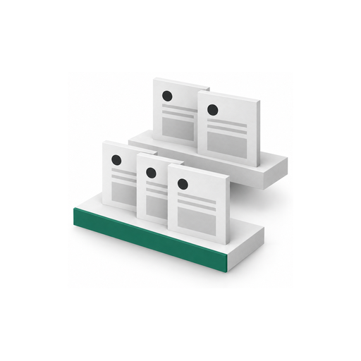
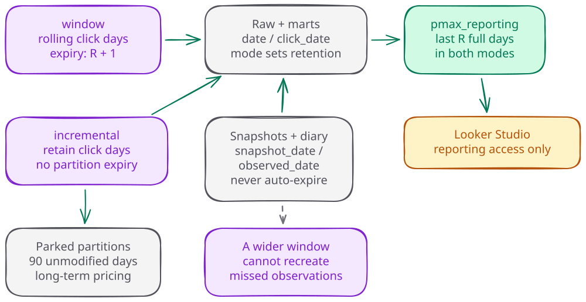

# Storage, history, and recovery

`storage` controls whether older click-day history survives. It does not
change the dashboard window: both modes publish the last
`reporting_window_days` complete days into `pmax_reporting` after validation.
Choose the storage mode before the upgrade, then review the actual retention
map through the deployment ladder.

## Choose the history you need

| Decision | `window` | `incremental` |
|---|---|---|
| Nightly re-pull | Configured reporting window plus the partial run day. | Same. |
| Older raw and derived click-day partitions | Expire after `reporting_window_days + 1` days. | Retained without partition expiration. |
| Historical backfill | Disabled; pending count is zero. | Pending monthly chunks are landed and checkpointed. |
| `start_date` | Ignored, with a warning if supplied. | Must be the first day of a month; omitted value is month-aligned. |
| Entity snapshots and observations | Retained. | Retained. |
| What Looker sees | Last validated reporting window, ending yesterday. | The same bounded reporting window. |
| Main tradeoff | Smaller click-day history, with loss when older partitions expire. | Accumulating history and storage cost; old partitions stop receiving nightly restatements. |

The fresh-config default is `window` with a 90-day reporting window. Upgrades
require an explicit storage choice. In incremental mode, an omitted
`start_date` becomes the first day of the month containing the run date minus
`reporting_window_days`; the warning names the resolved date. Set it explicitly
when an operator needs a reproducible backfill start.

An incremental history rebuild can rederive retained raw days, while the
reporting publication still clips its output to the configured window.
Retaining older data does not create old asset observation readings. Those
readings exist only if a successful run captured them at the time.

## Retention follows the partition column

The code derives its retention map from raw and ops specifications plus every
physical table declared by the SQL manifest and applies the following rule:

| Dataset and partition column | Examples | Window mode | Incremental mode |
|---|---|---|---|
| Raw or marts, `date` | Raw facts, staging facts, performance marts | `R + 1` days | Never expire |
| Raw or marts, `click_date` | Lookback windows, lag prefixes, observation cells, cohort marts | `R + 1` days | Never expire |
| Raw or marts, `snapshot_date` | Raw entities, typed entity history, best-practice scores | Never expire | Never expire |
| Raw, `observed_date` | `raw_observations` | Never expire | Never expire |
| Reporting or ops, any column | Published tables, checkpoints, run and stage evidence | Never expire | Never expire |

Here `R` is `reporting_window_days`. In particular, a best-practice mart
partitioned by `snapshot_date` does not expire merely because it is a mart.
Reporting tables have no TTL; the publish transaction replaces their contents
to enforce the visible window. Verify twins are temporary rehearsal datasets
with their own seven-day table default.

BigQuery calculates daily partition expiration from midnight UTC at the
partition boundary. Writing a partition again does not move that boundary.
The extra `+1` day leaves the oldest fetched click day present while the
nightly replacement runs. For `R = 90`, the operator confirms 91, and the
published table still contains 90 complete days. The runtime also refuses a
window-mode fact swap after the UTC day has changed. See Google's
[partition-expiration semantics](https://docs.cloud.google.com/bigquery/docs/managing-partitioned-tables#set_the_partition_expiration).

Live raw, marts, reporting, and ops datasets must have no default table or
partition expiration. Whole-table expiration can erase a protected class even
when its partition option says never. The runtime checks live table options
and emits SOFT retention drift; it never fixes options. A changed config must
therefore go through the ladder again. The [data model](data-model.md#retention-by-partition-column)
describes the inventory, guards, locking, and durable retention record.

## Switching modes changes what can be recovered

Moving from incremental to window applies a TTL to all managed click-day
tables. Existing partitions older than that TTL become eligible for expiry at
once. The change is destructive even when the ALTER list is short. BigQuery
marks expired partitions first and deletes them asynchronously, so an
immediate row-count check may still show old data. The table options show the
retention state immediately; a row count only confirms the deletion later.
Automatic partition expiration does not produce a `TableDataChange` audit
entry; whole-table expiration has a separate system-event record. Google
documents [partition-expiration behavior](https://docs.cloud.google.com/bigquery/docs/managing-partitioned-tables#set_the_partition_expiration)
and [audit-log event coverage](https://docs.cloud.google.com/bigquery/docs/reference/auditlogs)
separately.

Moving back to incremental clears click-day expiration before historical
backfill begins. It stops future expiry; it does not restore already expired
rows. Within the recorded recovery deadline, follow the migration's
per-table recovery procedure. Beyond that deadline, recover supported raw
history from Google where available and rebuild derived tables. Neither route
reconstructs an observation reading that was never collected or whose last
copy was deleted.

Use the [v2.1.0 migration](migrations/v2.1.0.md) for the two-pass procedure,
retention rehearsal, confirmation with the exact echoed retention value, and
rollback. The human-run
retention phase records the original inventory and time-travel evidence
before mutation. A retry keeps that original recovery scope and its original
deadline. A config edit alone is not a retention change.

## Old incremental partitions can cost less

Once an older partition has gone 90 consecutive days without modification,
BigQuery applies long-term storage pricing to that partition. Queries and
exports do not reset that clock; writing or restating the data does. Google's
[cost guide](https://docs.cloud.google.com/bigquery/docs/best-practices-costs#use_long-term_storage)
also warns that schema `ALTER` statements, table-property changes such as
labels or expiration, and other metadata changes can return data to active
storage. Review phase 68's `ADD COLUMN` and phase 89's `SET OPTIONS` when
estimating the cost of parked incremental history. Each partition qualifies
independently, so nightly writes inside the reporting window do not by
themselves reset parked older partitions. Consult the
[BigQuery storage pricing page](https://cloud.google.com/bigquery/pricing#storage)
and select the deployment's region and billing model; this guide deliberately
prints no rates.

Long-term BigQuery pricing does not apply to Avro objects in Cloud Storage.
The report bucket's `observations/<account>/<observed_date>/` copies sit outside
its report lifecycle. Account for them separately. Reducing their retention is
an incident or policy decision that must follow the data-protection procedure,
not an incidental cost cleanup.

## The observation bound is a permanent-loss decision

Observation collection uses the smaller of the reporting window and the
largest required reading age plus the restatement margin. The [cohort
guide](cohorts.md#how-much-observation-history-is-collected) gives the exact
formula, fallback, fetched-interval clamp, and both forfeited ranges.

A smaller reporting window can prevent an asset's final reading from ever
being recorded. Google does not report what a cumulative value was on a past
morning, so a larger window only helps future runs. Incremental storage
preserves collected observations without extending the observation bound.
Review action windows and forfeited-action warnings before reducing
`reporting_window_days` or the ladder.

The same limitation applies to deletion. Removing an observation partition
and all its Avro copies permanently removes that day's evidence. The affected
asset rungs then remain unavailable unless a permitted earlier non-seed
reading is within five calendar days. Never remove observations
mid-ladder. Keep every preserved pass-1 baseline, abandon any unfinished
pre-deletion generation, and use the public
[observation baseline query](operations.md#observation-baseline-query) to
re-record the active observation reading before starting a fresh generation.
Follow the [incident procedure](operations.md#incident-deletion-and-recovery)
to select an unused reviewed image identity; forcing a build alone does not
guarantee a digest without a preserved pass-1 baseline. If the resolved digest
already has a preserved pass-1 baseline, stop. Never delete or lower a
preserved pass-1 baseline to make the phase-95 observation gate pass.

## Deletion and residual retention

The [operations data-protection procedure](operations.md) owns the generated
deletion list and the three incident cases: observation partitions plus their
Avro copies, older incremental click days plus every enumerated copy, and
in-window click days that the next extraction would re-fetch while the account
remains configured. Do not treat deleting one raw table as complete deletion.

BigQuery retains changed or deleted data through the dataset's time-travel
window, from two to seven days, followed by an additional seven-day fail-safe
period. Use the actual `time_travel_hours` and its `metadata` or `default`
source recorded by the ladder, not an assumed seven-day recovery window.
Fail-safe is not a normal operator query or restore path. See Google's
[data-retention documentation](https://docs.cloud.google.com/bigquery/docs/time-travel).

Cloud Storage copies and Looker cached results have separate lifetimes. Follow
the incident procedure for copies and the [Looker guide](looker.md) for cache
freshness and access revocation before closing the incident.
